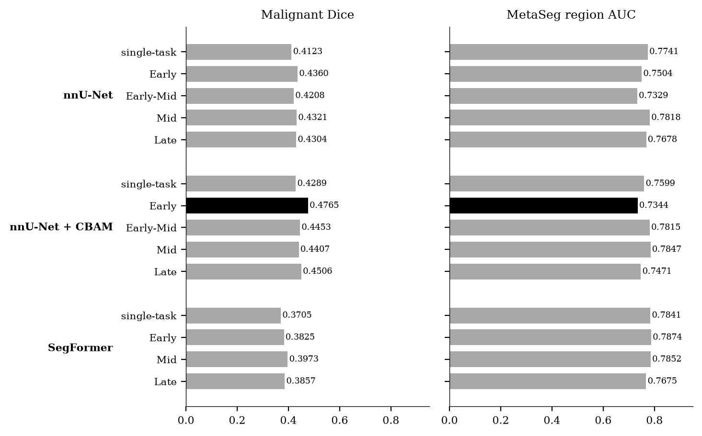
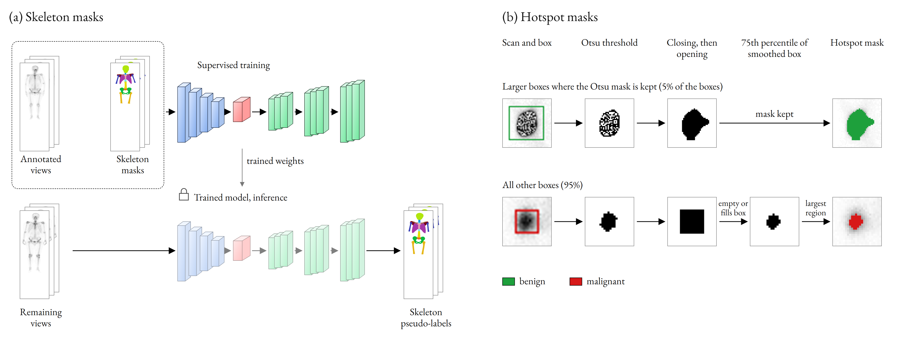
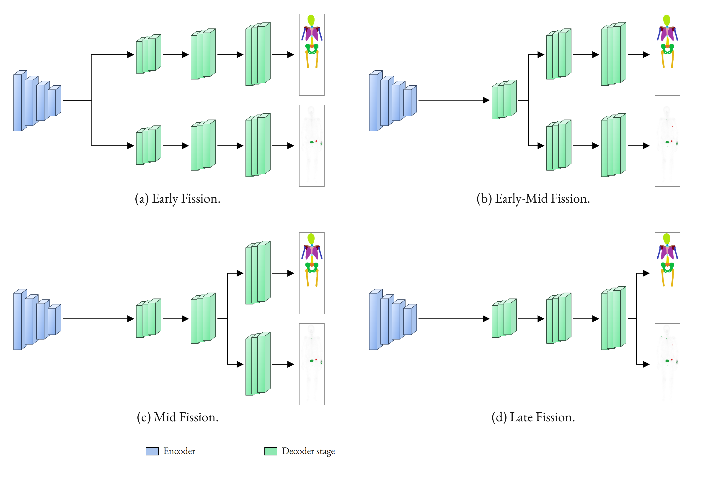

# Multi-Task Hotspot and Skeleton Segmentation on Whole-Body Bone Scintigraphy with Uncertainty Quantification

Supplementary material for the paper of the same title. It holds what the paper cannot state: the results of all fourteen checkpoints, the statistical tests, the uncertainty methods in full, more examples, the training and label details, and the data description.

## Data

The hotspot masks (thresholded from the bounding boxes) and the skeleton masks (manual and predicted) are on Zenodo: [10.5281/zenodo.23190333](https://doi.org/10.5281/zenodo.23190333). The scans are in BS-80K.

## Sections

| File | Section | Content |
|:---|:---|:---|
| [s01_results_all_checkpoints.md](s01_results_all_checkpoints.md) | S1 | Results of all fourteen checkpoints: Dice under both definitions, skeleton Dice per region, hotspot detection, regions per view |
| [s02_paired_tests.md](s02_paired_tests.md) | S2 | All paired tests: 91 Dice pairs, 91 McNemar pairs on matched hotspots, UQ run against standard pipeline |
| [s03_uncertainty_methods.md](s03_uncertainty_methods.md) | S3 | Seven uncertainty methods on every checkpoint, view, and class, benign results, Table IV for all checkpoints |
| [s04_paired_auc_tests.md](s04_paired_auc_tests.md) | S4 | Paired AUC tests of MetaSeg against the other methods and of the proposed checkpoint against every other checkpoint |
| [s05_uncertainty_examples.md](s05_uncertainty_examples.md) | S5 | Twelve uncertainty examples of the proposed checkpoint with region scores and decisions |
| [s06_froc_curves.md](s06_froc_curves.md) | S6 | FROC curves of every checkpoint and method |
| [s07_comparison_examples.md](s07_comparison_examples.md) | S7 | Predictions of all fourteen checkpoints on the same test images |
| [s08_model_size_and_speed.md](s08_model_size_and_speed.md) | S8 | Parameters, FLOPs, and forward time |
| [s09_training_details.md](s09_training_details.md) | S9 | Training settings, warm start, the collapsed first training, training curves |
| [s10_architecture_diagrams.md](s10_architecture_diagrams.md) | S10 | CBAM block and the nnU-Net and SegFormer networks |
| [s11_label_generation.md](s11_label_generation.md) | S11 | Hotspot mask algorithm, path shares, other algorithms, skeleton label sources, box cross-check |
| [s12_data_description.md](s12_data_description.md) | S12 | Split rule and counts per split and view |
| [s13_prior_studies.md](s13_prior_studies.md) | S13 | Table I extended with its evidence, and the five removed studies |
| [s14_statements_cut_from_paper.md](s14_statements_cut_from_paper.md) | S14 | Statements cut from the paper, restated with numbers from the metric files |

## Rules

| Topic | Rule |
|:---|:---|
| Numbers | Every number comes from a CSV file in `tables/`. The Markdown sections are written from those files by `scripts/build_sections.py`. |
| Dice | The Dice of the paper is the mean over the test images whose ground truth contains the class (203 malignant, 473 benign), computed on the predictions of the UQ run, one full-image forward pass per view. Each table states the definition it uses. S1 explains the second definition and the standard-pipeline run. |
| Checkpoint names | The names in the table below are used in every table and in the CSV files. For nnU-Net and nnU-Net with CBAM, `multihead` is Late fission and `multidecoder` is Early fission. The SegFormer run folders `dual_decoder`, `dual_fuse`, and `dual_head` are Early, Mid, and Late fission. |
| Methods | Predictive entropy, local gradient UQ, MetaSeg, and standardized max logit are the methods of the paper. Max-softmax, Mahalanobis distance, and inverse area (a control) appear only in S3 and S4. |
| Colors | Benign hotspots are green (30, 160, 60) and malignant hotspots are red (215, 25, 25) in the images. |
| Scope | Nothing is trained or re-run to write these sections. External classification and saliency analyses are not part of them. |

## Checkpoints

| Checkpoint | Backbone | Training | Fission point |
|:---|:---|:---|:---|
| `nnunet_single` | nnU-Net | single-task | - |
| `nnunet_early` | nnU-Net | multi-task | Early |
| `nnunet_earlymid` | nnU-Net | multi-task | Early-Mid |
| `nnunet_mid` | nnU-Net | multi-task | Mid |
| `nnunet_late` | nnU-Net | multi-task | Late |
| `nnunetcbam_single` | nnU-Net + CBAM | single-task | - |
| `nnunetcbam_multidecoder`* | nnU-Net + CBAM | multi-task | Early |
| `nnunetcbam_earlymid` | nnU-Net + CBAM | multi-task | Early-Mid |
| `nnunetcbam_mid` | nnU-Net + CBAM | multi-task | Mid |
| `nnunetcbam_multihead` | nnU-Net + CBAM | multi-task | Late |
| `segformer_single` | SegFormer | single-task | - |
| `segformer_early` | SegFormer | multi-task | Early |
| `segformer_mid` | SegFormer | multi-task | Mid |
| `segformer_late` | SegFormer | multi-task | Late |

\* The proposed method: nnU-Net with CBAM at Early fission, with MetaSeg filtering.

## Metrics

| Checkpoint | Malignant Dice | Benign Dice | Skeleton Dice | AUC without UQ | AUC with MetaSeg |
|:---|---:|---:|---:|---:|---:|
| `nnunet_single` | 0.4123 | 0.5288 | - | 0.8202 | 0.7741 |
| `nnunet_early` | 0.4360 | 0.5287 | 0.8819 | 0.8375 | 0.7504 |
| `nnunet_earlymid` | 0.4208 | 0.5418 | 0.8817 | 0.8205 | 0.7329 |
| `nnunet_mid` | 0.4321 | 0.5232 | 0.8458 | 0.8412 | 0.7818 |
| `nnunet_late` | 0.4304 | 0.5472 | 0.8506 | 0.8425 | 0.7678 |
| `nnunetcbam_single` | 0.4289 | 0.5220 | - | 0.8119 | 0.7599 |
| `nnunetcbam_multidecoder`* | 0.4765 | 0.5390 | 0.8810 | 0.8398 | 0.7344 |
| `nnunetcbam_earlymid` | 0.4453 | 0.5347 | 0.8805 | 0.8188 | 0.7815 |
| `nnunetcbam_mid` | 0.4407 | 0.5286 | 0.8403 | 0.8243 | 0.7847 |
| `nnunetcbam_multihead` | 0.4506 | 0.5486 | 0.8392 | 0.8173 | 0.7471 |
| `segformer_single` | 0.3705 | 0.5319 | - | 0.8262 | 0.7841 |
| `segformer_early` | 0.3825 | 0.5498 | 0.8815 | 0.8176 | 0.7874 |
| `segformer_mid` | 0.3973 | 0.5451 | 0.8810 | 0.8350 | 0.7852 |
| `segformer_late` | 0.3857 | 0.5473 | 0.8740 | 0.8357 | 0.7675 |

Dice is the mean over the test images whose ground truth contains the class (203 malignant, 473 benign), on the UQ run. Skeleton Dice is the mean over the twelve regions on the standard-pipeline run. AUC without UQ detects the images with a malignant hotspot from the predicted malignant area of the model, on the standard-pipeline predictions (203 positive and 383 negative images). AUC with MetaSeg separates true from false predicted regions with the MetaSeg score, as the mean over the two views and the two classes. \* The proposed method. All other metrics are in the sections above.

## Code

The training and inference code is in two repositories.

| Repository | Content |
|:---|:---|
| [nnunetv2-multitask](https://github.com/Liamours/nnunetv2-multitask) | Fork of nnU-Net v2 for multi-task segmentation |
| [segformer-multitask](https://github.com/Liamours/segformer-multitask) | Multi-task SegFormer |

The `code/` folder here holds `hotspot_thresholding/`, the code that makes the hotspot masks from the BS-80K bounding boxes.

## Figures of the paper

## Regenerate

The sections are rebuilt from `tables/` and `figures/` alone. The two collection steps read the saved results of the project and need the project folder.

| Output | Command |
|:---|:---|
| Section files and this README | `uv run --no-project --with pandas python scripts/build_sections.py` |
| `tables/` and the copied figures | `uv run --no-project --with pandas --with tqdm python scripts/collect_sources.py --project <project folder>` |
| `tables/image_level_auc.csv` | `uv run --no-project --with pandas --with numpy --with pillow --with matplotlib --with tqdm python scripts/compute_image_auc.py --project <project folder>` |
| Figures of S5, S7, S9, S11 and the metrics figure | `uv run --no-project --with pandas --with numpy --with pillow --with matplotlib --with tqdm python scripts/make_figures.py all --project <project folder>` |

The metric files in `tables/` were computed from the saved test predictions and uncertainty records by the scripts of the project. The FROC plots of S6, the training progress plots of S9, and the diagrams of S10 are copied from the project, not redrawn here.
