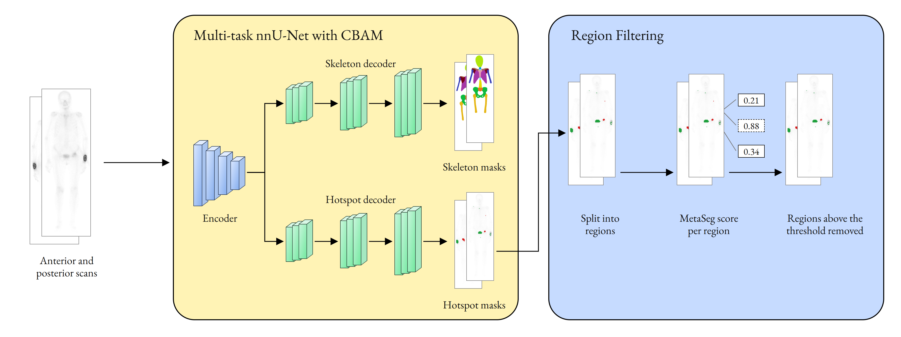
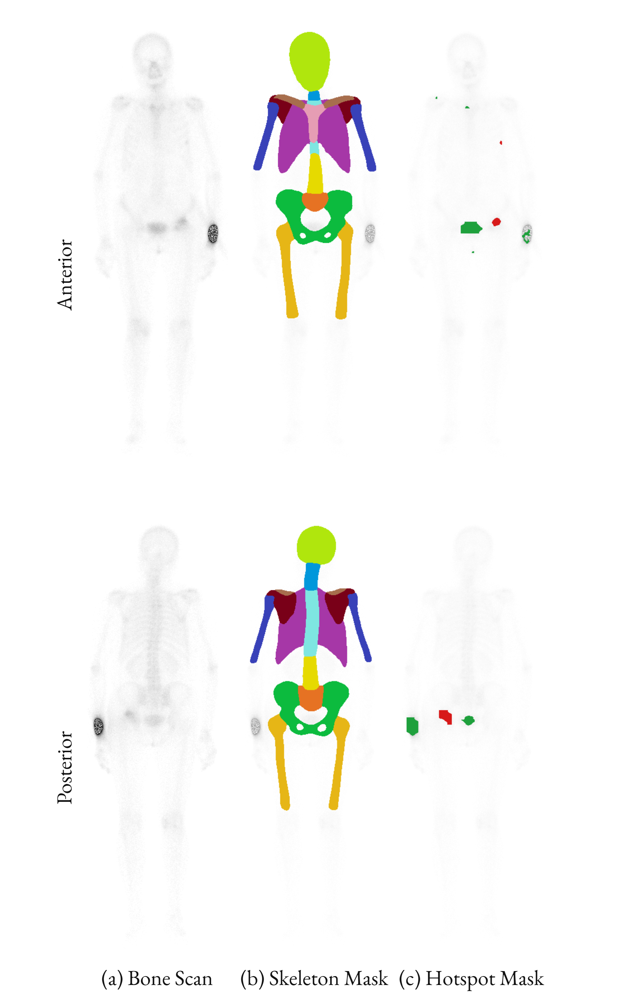
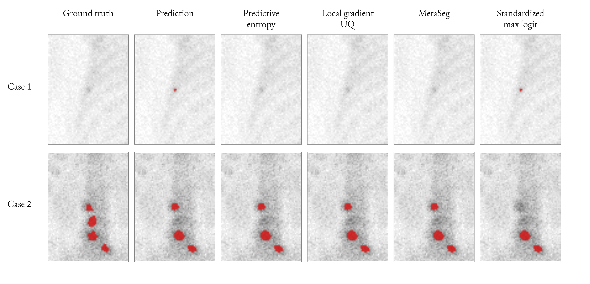

# Multi-Task Hotspot and Skeleton Segmentation on Whole-Body Bone Scintigraphy with Uncertainty Quantification

Supplementary material for the paper of the same title. The paper holds the method and results. This repository holds the figures and the code location.

## Code

The training and inference code is in two repositories.

| Repository | Content |
|---|---|
| [nnunetv2-multitask](https://github.com/Liamours/nnunetv2-multitask) | Fork of nnU-Net v2 for multi-task segmentation |
| [segformer-multitask](https://github.com/Liamours/segformer-multitask) | Multi-task SegFormer |

The `code/` folder here is reserved for the evaluation and uncertainty scripts.

## Figures

### Label generation

### Method overview

### Example case

### Decoder fission points

### Example results

