# S5. More uncertainty examples

Twelve test cases of the proposed checkpoint (`nnunetcbam_multidecoder`, nnU-Net + CBAM, Early), predicted malignant regions, with the four uncertainty methods of the paper. Six cases are in the group `agree`, where the methods make the same decision on every false region, and six are in the group `disagree`, where they differ on at least one false region. The predictions are those of the UQ run. A region is removed when its score is above the threshold fitted on the validation split. Red is malignant.

## Summary per case

| Case | Group | Regions | True | False | False regions with differing decisions | Predictive entropy, false removed / true removed | Local gradient UQ, false removed / true removed | MetaSeg, false removed / true removed | Standardized max logit, false removed / true removed |
|:---|:---|---:|---:|---:|---:|---:|---:|---:|---:|
| `bs80k_0109` | agree | 8 | 6 | 2 | 0 | 0 / 0 | 0 / 0 | 0 / 0 | 0 / 1 |
| `bs80k_1259` | agree | 7 | 5 | 2 | 0 | 0 / 0 | 0 / 0 | 0 / 0 | 0 / 0 |
| `bs80k_1401` | agree | 7 | 2 | 5 | 0 | 0 / 1 | 0 / 1 | 0 / 0 | 0 / 1 |
| `bs80k_2694` | agree | 7 | 6 | 1 | 0 | 0 / 1 | 0 / 1 | 0 / 1 | 0 / 1 |
| `bs80k_0689` | agree | 6 | 2 | 4 | 0 | 2 / 0 | 2 / 0 | 2 / 0 | 2 / 0 |
| `bs80k_2110` | agree | 6 | 4 | 2 | 0 | 0 / 0 | 0 / 0 | 0 / 0 | 0 / 0 |
| `bs80k_1140` | disagree | 2 | 1 | 1 | 1 | 0 / 0 | 1 / 0 | 1 / 0 | 0 / 0 |
| `bs80k_0917` | disagree | 6 | 4 | 2 | 2 | 1 / 0 | 1 / 0 | 2 / 0 | 0 / 0 |
| `bs80k_0530` | disagree | 4 | 1 | 3 | 2 | 1 / 0 | 1 / 0 | 1 / 0 | 0 / 0 |
| `bs80k_1545` | disagree | 3 | 1 | 2 | 1 | 1 / 0 | 1 / 0 | 0 / 0 | 0 / 0 |
| `bs80k_3019` | disagree | 8 | 5 | 3 | 1 | 1 / 0 | 1 / 0 | 0 / 1 | 0 / 0 |
| `bs80k_2866` | disagree | 4 | 1 | 3 | 2 | 0 / 0 | 0 / 0 | 2 / 0 | 0 / 0 |

## Categories

| Category | Cases |
|:---|:---|
| The four methods make the same decision on every false region | `bs80k_0109`, `bs80k_1259`, `bs80k_1401`, `bs80k_2694`, `bs80k_0689`, `bs80k_2110` |
| The methods differ on at least one false region | `bs80k_1140`, `bs80k_0917`, `bs80k_0530`, `bs80k_1545`, `bs80k_3019`, `bs80k_2866` |
| At least one method removes a true region | `bs80k_0109`, `bs80k_1401`, `bs80k_2694`, `bs80k_3019` |
| Every method keeps every false region | `bs80k_0109`, `bs80k_1259`, `bs80k_1401`, `bs80k_2694`, `bs80k_2110` |

A category with no case is stated as none. The last category means false regions exist in the case and no method removes any of them.

## Agree 1, case `bs80k_0109`

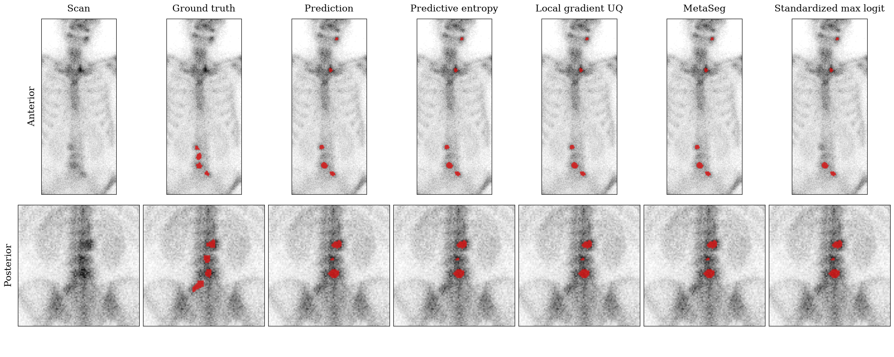

8 regions, 6 true and 2 false.

## Agree 2, case `bs80k_1259`

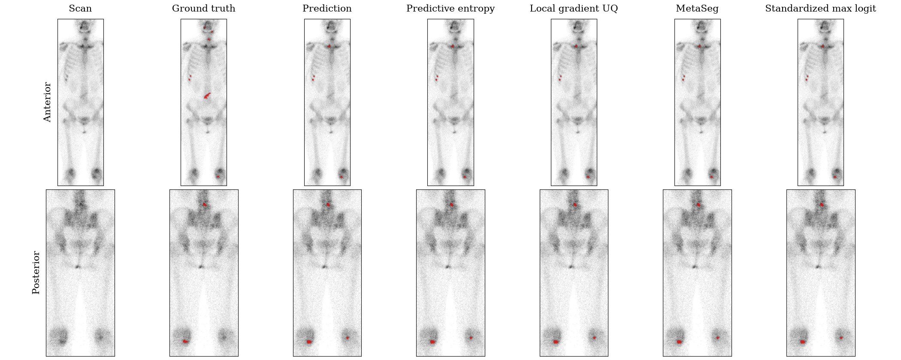

7 regions, 5 true and 2 false.

## Agree 3, case `bs80k_1401`

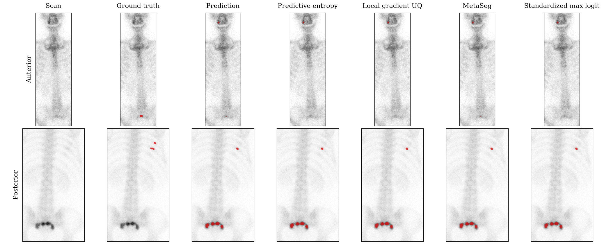

7 regions, 2 true and 5 false.

## Agree 4, case `bs80k_2694`

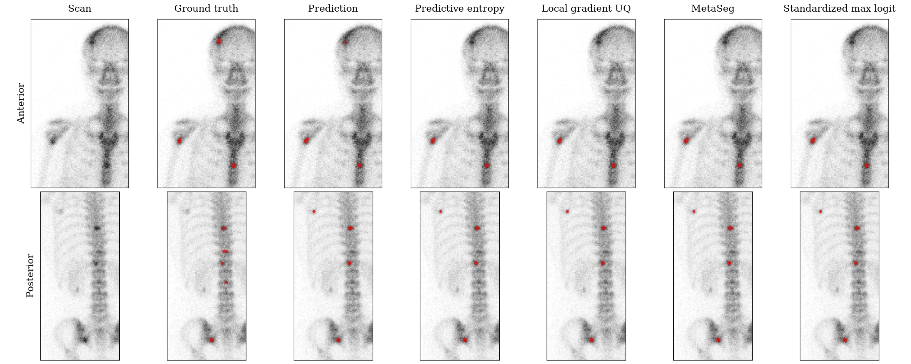

7 regions, 6 true and 1 false.

## Agree 5, case `bs80k_0689`

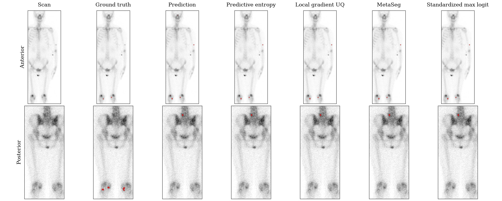

6 regions, 2 true and 4 false.

## Agree 6, case `bs80k_2110`

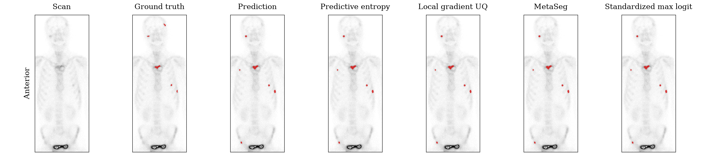

6 regions, 4 true and 2 false.

## Disagree 1, case `bs80k_1140`

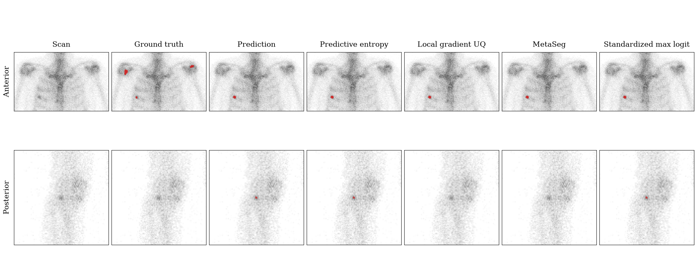

2 regions, 1 true and 1 false.

## Disagree 2, case `bs80k_0917`

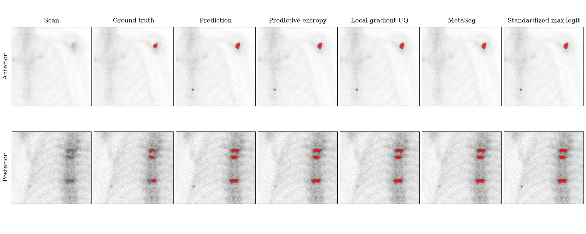

6 regions, 4 true and 2 false.

## Disagree 3, case `bs80k_0530`

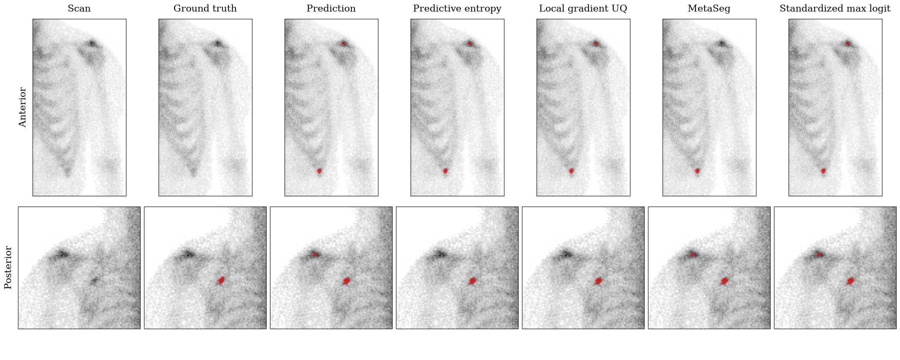

4 regions, 1 true and 3 false.

## Disagree 4, case `bs80k_1545`

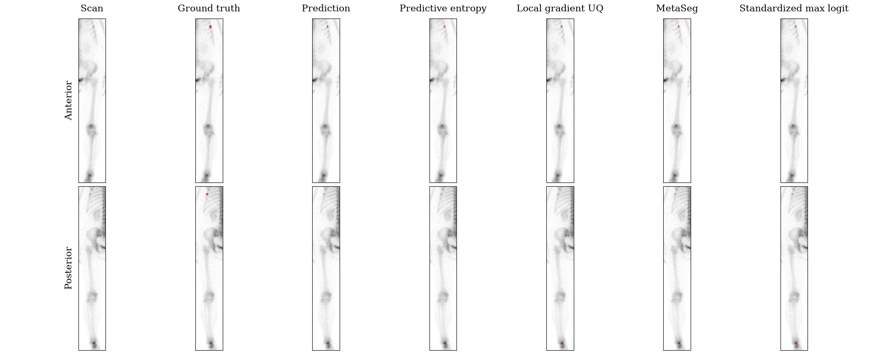

3 regions, 1 true and 2 false.

## Disagree 5, case `bs80k_3019`

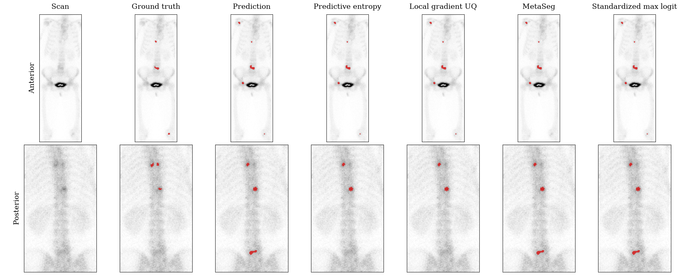

8 regions, 5 true and 3 false.

## Disagree 6, case `bs80k_2866`

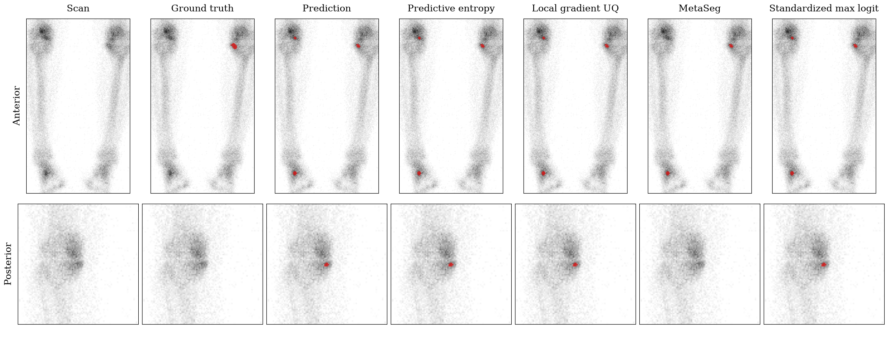

4 regions, 1 true and 3 false.

## Region scores and decisions

| Case | View | Region | Area in pixels | Type | Predictive entropy | Local gradient UQ | MetaSeg | Standardized max logit |
|:---|:---|---:|---:|:---|---:|---:|---:|---:|
| `bs80k_0109` | anterior | 1 | 13 | false | 0.0677 keep | 79.5675 keep | 0.6273 keep | 0.6042 keep |
| `bs80k_0109` | anterior | 2 | 20 | false | 0.0793 keep | 101.4419 keep | 0.5956 keep | 0.0276 keep |
| `bs80k_0109` | anterior | 3 | 27 | true | 0.1494 keep | 147.8661 keep | 0.4439 keep | 1.0573 remove |
| `bs80k_0109` | anterior | 4 | 53 | true | 0.0725 keep | 87.5284 keep | 0.3035 keep | 0.1986 keep |
| `bs80k_0109` | anterior | 5 | 32 | true | 0.0396 keep | 47.4024 keep | 0.3201 keep | -0.6438 keep |
| `bs80k_0109` | posterior | 1 | 38 | true | 0.1045 keep | 157.6948 keep | 0.2345 keep | -0.3208 keep |
| `bs80k_0109` | posterior | 2 | 5 | true | 0.1863 keep | 330.3107 keep | 0.6078 keep | 0.8145 keep |
| `bs80k_0109` | posterior | 3 | 46 | true | 0.0681 keep | 89.6608 keep | 0.1365 keep | -0.5832 keep |
| `bs80k_1259` | anterior | 1 | 34 | false | 0.0823 keep | 111.6187 keep | 0.3878 keep | -0.1773 keep |
| `bs80k_1259` | anterior | 2 | 14 | true | 0.0533 keep | 83.9212 keep | 0.6069 keep | 0.1104 keep |
| `bs80k_1259` | anterior | 3 | 20 | true | 0.0141 keep | 15.3572 keep | 0.3994 keep | -0.8906 keep |
| `bs80k_1259` | anterior | 4 | 32 | true | 0.0209 keep | 20.7957 keep | 0.2754 keep | -0.5792 keep |
| `bs80k_1259` | posterior | 1 | 25 | true | 0.1034 keep | 155.7337 keep | 0.2788 keep | -0.0291 keep |
| `bs80k_1259` | posterior | 2 | 13 | false | 0.0873 keep | 116.3023 keep | 0.4879 keep | 0.4374 keep |
| `bs80k_1259` | posterior | 3 | 43 | true | 0.0484 keep | 59.6381 keep | 0.2968 keep | -0.6900 keep |
| `bs80k_1401` | anterior | 1 | 15 | false | 0.0850 keep | 128.5630 keep | 0.6457 keep | 0.0527 keep |
| `bs80k_1401` | anterior | 2 | 2 | true | 0.6540 remove | 969.1489 remove | 0.7351 keep | 2.2519 remove |
| `bs80k_1401` | posterior | 1 | 14 | true | 0.1467 keep | 214.3500 keep | 0.3196 keep | 0.5977 keep |
| `bs80k_1401` | posterior | 2 | 28 | false | 0.0457 keep | 84.3888 keep | 0.2756 keep | -2.9483 keep |
| `bs80k_1401` | posterior | 3 | 31 | false | 0.0572 keep | 88.1295 keep | 0.2642 keep | -3.1760 keep |
| `bs80k_1401` | posterior | 4 | 38 | false | 0.0540 keep | 57.7804 keep | 0.2015 keep | -2.4689 keep |
| `bs80k_1401` | posterior | 5 | 23 | false | 0.0643 keep | 87.6295 keep | 0.2603 keep | -1.4794 keep |
| `bs80k_2694` | anterior | 1 | 8 | true | 0.2410 remove | 395.0043 remove | 0.7445 remove | 1.2724 remove |
| `bs80k_2694` | anterior | 2 | 31 | true | 0.0223 keep | 29.2449 keep | 0.3743 keep | -0.6607 keep |
| `bs80k_2694` | anterior | 3 | 25 | true | 0.0451 keep | 70.3026 keep | 0.4489 keep | -0.0625 keep |
| `bs80k_2694` | posterior | 1 | 12 | false | 0.1528 keep | 192.0347 keep | 0.3246 keep | 0.7343 keep |
| `bs80k_2694` | posterior | 2 | 25 | true | 0.1002 keep | 149.6552 keep | 0.2516 keep | -1.1102 keep |
| `bs80k_2694` | posterior | 3 | 21 | true | 0.1202 keep | 189.5044 keep | 0.2992 keep | -0.3697 keep |
| `bs80k_2694` | posterior | 4 | 25 | true | 0.0644 keep | 87.6065 keep | 0.3309 keep | -1.1004 keep |
| `bs80k_0689` | anterior | 1 | 5 | false | 0.2296 remove | 378.0958 remove | 0.9391 remove | 1.3661 remove |
| `bs80k_0689` | anterior | 2 | 14 | false | 0.0688 keep | 82.3851 keep | 0.6180 keep | 0.3116 keep |
| `bs80k_0689` | anterior | 3 | 5 | false | 0.3231 remove | 609.5118 remove | 0.9294 remove | 1.4989 remove |
| `bs80k_0689` | anterior | 4 | 17 | true | 0.0856 keep | 115.2001 keep | 0.5474 keep | 0.2151 keep |
| `bs80k_0689` | anterior | 5 | 30 | true | 0.0509 keep | 61.1476 keep | 0.3460 keep | -0.6789 keep |
| `bs80k_0689` | posterior | 1 | 18 | false | 0.1183 keep | 193.0745 keep | 0.3102 keep | 0.1964 keep |
| `bs80k_2110` | anterior | 1 | 21 | true | 0.0307 keep | 33.8806 keep | 0.4033 keep | -0.5288 keep |
| `bs80k_2110` | anterior | 2 | 95 | true | 0.0617 keep | 63.5786 keep | 0.2817 keep | -0.5985 keep |
| `bs80k_2110` | anterior | 3 | 10 | false | 0.1798 keep | 235.9612 keep | 0.7040 keep | 0.8347 keep |
| `bs80k_2110` | anterior | 4 | 19 | true | 0.0839 keep | 86.7706 keep | 0.5844 keep | -0.0586 keep |
| `bs80k_2110` | anterior | 5 | 32 | true | 0.1024 keep | 117.2049 keep | 0.3653 keep | -0.1276 keep |
| `bs80k_2110` | anterior | 6 | 18 | false | 0.0712 keep | 74.8294 keep | 0.5576 keep | 0.5154 keep |
| `bs80k_1140` | anterior | 1 | 23 | true | 0.0343 keep | 50.5097 keep | 0.4037 keep | -0.9906 keep |
| `bs80k_1140` | posterior | 1 | 3 | false | 0.3014 keep | 461.5082 remove | 0.8719 remove | 1.1846 keep |
| `bs80k_0917` | anterior | 1 | 48 | true | 0.0296 keep | 39.8014 keep | 0.3154 keep | -1.8310 keep |
| `bs80k_0917` | anterior | 2 | 7 | false | 0.1629 keep | 248.5159 keep | 0.8584 remove | 0.9880 keep |
| `bs80k_0917` | posterior | 1 | 45 | true | 0.0708 keep | 89.4107 keep | 0.1419 keep | -0.3582 keep |
| `bs80k_0917` | posterior | 2 | 37 | true | 0.0749 keep | 87.6527 keep | 0.1398 keep | -0.0984 keep |
| `bs80k_0917` | posterior | 3 | 55 | true | 0.0560 keep | 57.6827 keep | 0.1738 keep | -0.6059 keep |
| `bs80k_0917` | posterior | 4 | 3 | false | 0.4428 remove | 728.7424 remove | 0.7295 remove | 1.2515 keep |
| `bs80k_0530` | anterior | 1 | 9 | false | 0.1004 keep | 173.0526 keep | 0.7669 remove | 0.2679 keep |
| `bs80k_0530` | anterior | 2 | 17 | false | 0.0195 keep | 13.9057 keep | 0.4060 keep | -0.2168 keep |
| `bs80k_0530` | posterior | 1 | 6 | false | 0.3676 remove | 690.0238 remove | 0.5044 keep | 1.0218 keep |
| `bs80k_0530` | posterior | 2 | 20 | true | 0.0376 keep | 30.8906 keep | 0.1871 keep | -0.1750 keep |
| `bs80k_1545` | anterior | 1 | 18 | true | 0.0219 keep | 20.3522 keep | 0.4560 keep | -0.0311 keep |
| `bs80k_1545` | anterior | 2 | 12 | false | 0.2351 remove | 382.7890 remove | 0.6764 keep | 1.0404 keep |
| `bs80k_1545` | posterior | 1 | 25 | false | 0.1096 keep | 187.4618 keep | 0.6094 keep | -0.7760 keep |
| `bs80k_3019` | anterior | 1 | 35 | false | 0.0931 keep | 97.3326 keep | 0.4537 keep | 0.4119 keep |
| `bs80k_3019` | anterior | 2 | 13 | true | 0.1890 keep | 237.4481 keep | 0.6099 keep | 0.9343 keep |
| `bs80k_3019` | anterior | 3 | 116 | true | 0.0662 keep | 65.0844 keep | 0.2889 keep | 0.0009 keep |
| `bs80k_3019` | anterior | 4 | 38 | false | 0.0629 keep | 62.0247 keep | 0.3370 keep | -0.0641 keep |
| `bs80k_3019` | anterior | 5 | 8 | true | 0.1588 keep | 220.5410 keep | 0.8034 remove | 0.7833 keep |
| `bs80k_3019` | posterior | 1 | 14 | true | 0.1932 keep | 309.9549 keep | 0.3724 keep | 0.7148 keep |
| `bs80k_3019` | posterior | 2 | 24 | true | 0.1119 keep | 119.7177 keep | 0.2454 keep | -0.0451 keep |
| `bs80k_3019` | posterior | 3 | 32 | false | 0.3241 remove | 472.3106 remove | 0.4133 keep | 1.2268 keep |
| `bs80k_2866` | anterior | 1 | 10 | false | 0.0771 keep | 135.1734 keep | 0.7871 remove | 0.5188 keep |
| `bs80k_2866` | anterior | 2 | 19 | true | 0.1593 keep | 243.7352 keep | 0.6507 keep | 0.4815 keep |
| `bs80k_2866` | anterior | 3 | 22 | false | 0.0290 keep | 53.2363 keep | 0.5074 keep | -0.7912 keep |
| `bs80k_2866` | posterior | 1 | 9 | false | 0.1684 keep | 304.5785 keep | 0.6874 remove | 0.4888 keep |

A higher score means the region is more likely a false positive. The scores of different methods are on different scales. Source: `tables/uq_examples_regions.csv`.
