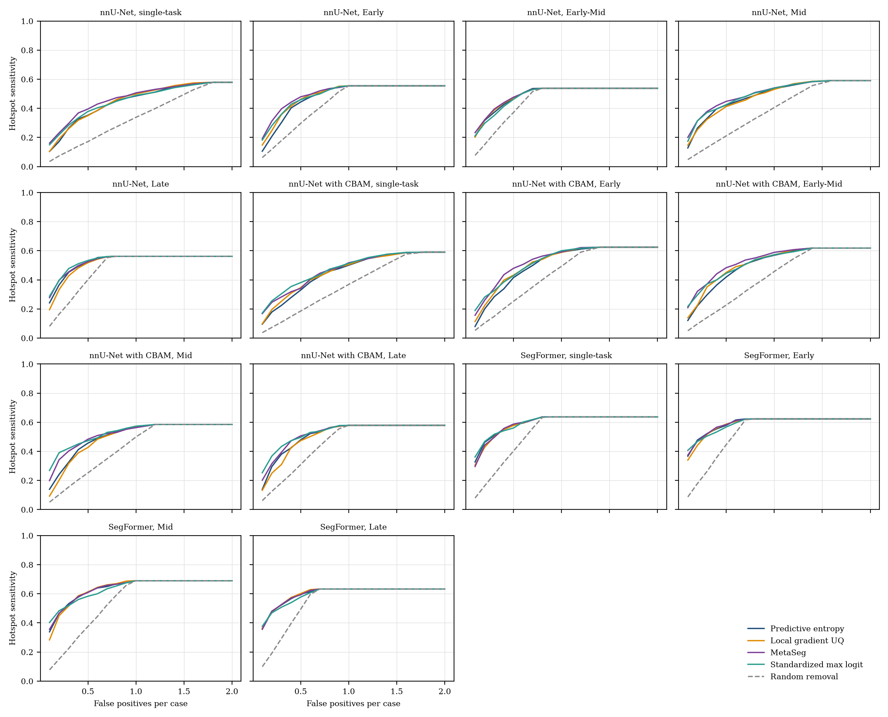
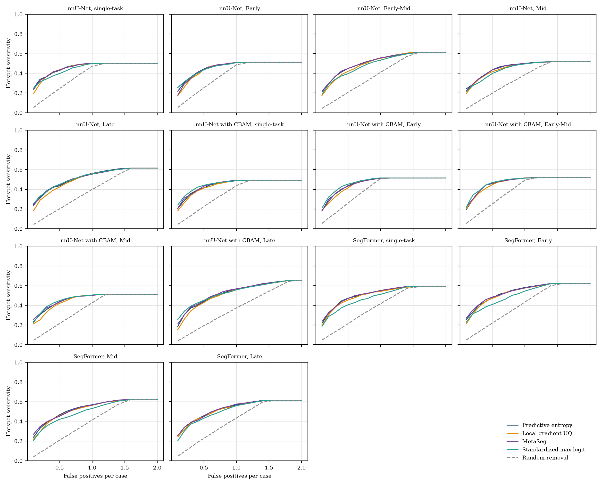

# S6. Full FROC curves

Hotspot sensitivity against false positives per case for every checkpoint. Predicted regions are removed in decreasing order of their score, and the curve is traced over 15 levels from 0.1 to 2.0 false positives per case. The dashed line removes regions in random order. UQ run, test split.

## Malignant hotspots

## Benign hotspots

## Hotspot sensitivity at 0.3 false positives per case, malignant

| Checkpoint | Predictive entropy | Local gradient UQ | MetaSeg | Standardized max logit | Random removal |
|:---|---:|---:|---:|---:|---:|
| nnU-Net, single-task (`nnunet_single`) | 0.2646 | 0.2603 | 0.2973 | 0.2845 | 0.1065 |
| nnU-Net, Early (`nnunet_early`) | 0.3030 | 0.3585 | 0.3969 | 0.3599 | 0.1787 |
| nnU-Net, Early-Mid (`nnunet_earlymid`) | 0.3727 | 0.3883 | 0.3954 | 0.3514 | 0.2292 |
| nnU-Net, Mid (`nnunet_mid`) | 0.3314 | 0.3243 | 0.3784 | 0.3713 | 0.1305 |
| nnU-Net, Late (`nnunet_late`) | 0.4523 | 0.4282 | 0.4552 | 0.4780 | 0.2396 |
| nnU-Net + CBAM, single-task (`nnunetcbam_single`) | 0.2248 | 0.2532 | 0.2831 | 0.3044 | 0.1093 |
| nnU-Net + CBAM, Early (`nnunetcbam_multidecoder`) | 0.2845 | 0.3101 | 0.3428 | 0.3257 | 0.1492 |
| nnU-Net + CBAM, Early-Mid (`nnunetcbam_earlymid`) | 0.2973 | 0.3514 | 0.3713 | 0.3713 | 0.1411 |
| nnU-Net + CBAM, Mid (`nnunetcbam_mid`) | 0.3257 | 0.3172 | 0.4026 | 0.4211 | 0.1554 |
| nnU-Net + CBAM, Late (`nnunetcbam_multihead`) | 0.3812 | 0.3101 | 0.3940 | 0.4339 | 0.1845 |
| SegFormer, single-task (`segformer_single`) | 0.5092 | 0.5007 | 0.4964 | 0.5178 | 0.2431 |
| SegFormer, Early (`segformer_early`) | 0.5220 | 0.5178 | 0.5206 | 0.5050 | 0.2624 |
| SegFormer, Mid (`segformer_mid`) | 0.5320 | 0.5164 | 0.5235 | 0.5192 | 0.2240 |
| SegFormer, Late (`segformer_late`) | 0.5235 | 0.5263 | 0.5263 | 0.5078 | 0.2936 |

## Hotspot sensitivity at 0.5 false positives per case, malignant

| Checkpoint | Predictive entropy | Local gradient UQ | MetaSeg | Standardized max logit | Random removal |
|:---|---:|---:|---:|---:|---:|
| nnU-Net, single-task (`nnunet_single`) | 0.3528 | 0.3499 | 0.3954 | 0.3784 | 0.1716 |
| nnU-Net, Early (`nnunet_early`) | 0.4438 | 0.4623 | 0.4794 | 0.4595 | 0.2971 |
| nnU-Net, Early-Mid (`nnunet_earlymid`) | 0.4680 | 0.4708 | 0.4765 | 0.4623 | 0.3715 |
| nnU-Net, Mid (`nnunet_mid`) | 0.4225 | 0.4125 | 0.4481 | 0.4253 | 0.2110 |
| nnU-Net, Late (`nnunet_late`) | 0.5192 | 0.5178 | 0.5249 | 0.5334 | 0.4011 |
| nnU-Net + CBAM, single-task (`nnunetcbam_single`) | 0.3300 | 0.3471 | 0.3414 | 0.3812 | 0.1860 |
| nnU-Net + CBAM, Early (`nnunetcbam_multidecoder`) | 0.4154 | 0.4324 | 0.4794 | 0.4282 | 0.2530 |
| nnU-Net + CBAM, Early-Mid (`nnunetcbam_earlymid`) | 0.4196 | 0.4509 | 0.4836 | 0.4452 | 0.2272 |
| nnU-Net + CBAM, Mid (`nnunetcbam_mid`) | 0.4566 | 0.4267 | 0.4836 | 0.4737 | 0.2521 |
| nnU-Net + CBAM, Late (`nnunetcbam_multihead`) | 0.4794 | 0.4737 | 0.5064 | 0.4964 | 0.3094 |
| SegFormer, single-task (`segformer_single`) | 0.5832 | 0.5775 | 0.5875 | 0.5605 | 0.4022 |
| SegFormer, Early (`segformer_early`) | 0.5789 | 0.5875 | 0.5832 | 0.5676 | 0.4464 |
| SegFormer, Mid (`segformer_mid`) | 0.6131 | 0.6117 | 0.6088 | 0.5832 | 0.3753 |
| SegFormer, Late (`segformer_late`) | 0.5989 | 0.6017 | 0.5932 | 0.5775 | 0.4942 |

## Hotspot sensitivity at 1.0 false positives per case, malignant

| Checkpoint | Predictive entropy | Local gradient UQ | MetaSeg | Standardized max logit | Random removal |
|:---|---:|---:|---:|---:|---:|
| nnU-Net, single-task (`nnunet_single`) | 0.4851 | 0.4993 | 0.5064 | 0.4893 | 0.3382 |
| nnU-Net, Early (`nnunet_early`) | 0.5548 | 0.5548 | 0.5548 | 0.5548 | 0.5548 |
| nnU-Net, Early-Mid (`nnunet_earlymid`) | 0.5377 | 0.5377 | 0.5377 | 0.5377 | 0.5377 |
| nnU-Net, Mid (`nnunet_mid`) | 0.5349 | 0.5306 | 0.5405 | 0.5391 | 0.4057 |
| nnU-Net, Late (`nnunet_late`) | 0.5619 | 0.5619 | 0.5619 | 0.5619 | 0.5619 |
| nnU-Net + CBAM, single-task (`nnunetcbam_single`) | 0.5007 | 0.5050 | 0.5178 | 0.5135 | 0.3688 |
| nnU-Net + CBAM, Early (`nnunetcbam_multidecoder`) | 0.5903 | 0.5889 | 0.5917 | 0.6003 | 0.4932 |
| nnU-Net + CBAM, Early-Mid (`nnunetcbam_earlymid`) | 0.5690 | 0.5718 | 0.5889 | 0.5733 | 0.4576 |
| nnU-Net + CBAM, Mid (`nnunetcbam_mid`) | 0.5676 | 0.5647 | 0.5633 | 0.5733 | 0.4992 |
| nnU-Net + CBAM, Late (`nnunetcbam_multihead`) | 0.5789 | 0.5789 | 0.5789 | 0.5789 | 0.5789 |
| SegFormer, single-task (`segformer_single`) | 0.6373 | 0.6373 | 0.6373 | 0.6373 | 0.6373 |
| SegFormer, Early (`segformer_early`) | 0.6230 | 0.6230 | 0.6230 | 0.6230 | 0.6230 |
| SegFormer, Mid (`segformer_mid`) | 0.6899 | 0.6899 | 0.6899 | 0.6899 | 0.6899 |
| SegFormer, Late (`segformer_late`) | 0.6330 | 0.6330 | 0.6330 | 0.6330 | 0.6330 |

## Hotspot sensitivity at 0.3 false positives per case, benign

| Checkpoint | Predictive entropy | Local gradient UQ | MetaSeg | Standardized max logit | Random removal |
|:---|---:|---:|---:|---:|---:|
| nnU-Net, single-task (`nnunet_single`) | 0.3661 | 0.3702 | 0.3669 | 0.3427 | 0.1511 |
| nnU-Net, Early (`nnunet_early`) | 0.3613 | 0.3468 | 0.3484 | 0.3621 | 0.1548 |
| nnU-Net, Early-Mid (`nnunet_earlymid`) | 0.3677 | 0.3306 | 0.3669 | 0.3379 | 0.1239 |
| nnU-Net, Mid (`nnunet_mid`) | 0.3492 | 0.3419 | 0.3476 | 0.3073 | 0.1219 |
| nnU-Net, Late (`nnunet_late`) | 0.3758 | 0.3411 | 0.3839 | 0.3750 | 0.1243 |
| nnU-Net + CBAM, single-task (`nnunetcbam_single`) | 0.3581 | 0.3395 | 0.3484 | 0.3790 | 0.1312 |
| nnU-Net + CBAM, Early (`nnunetcbam_multidecoder`) | 0.3516 | 0.3210 | 0.3548 | 0.3782 | 0.1549 |
| nnU-Net + CBAM, Early-Mid (`nnunetcbam_earlymid`) | 0.3823 | 0.3645 | 0.3823 | 0.3871 | 0.1545 |
| nnU-Net + CBAM, Mid (`nnunetcbam_mid`) | 0.3573 | 0.3315 | 0.3742 | 0.3863 | 0.1301 |
| nnU-Net + CBAM, Late (`nnunetcbam_multihead`) | 0.3734 | 0.3444 | 0.3831 | 0.3919 | 0.1158 |
| SegFormer, single-task (`segformer_single`) | 0.3831 | 0.3790 | 0.3831 | 0.3258 | 0.1306 |
| SegFormer, Early (`segformer_early`) | 0.4048 | 0.3879 | 0.4097 | 0.3452 | 0.1340 |
| SegFormer, Mid (`segformer_mid`) | 0.3903 | 0.3758 | 0.3935 | 0.3524 | 0.1229 |
| SegFormer, Late (`segformer_late`) | 0.3887 | 0.3823 | 0.3879 | 0.3718 | 0.1370 |

## Hotspot sensitivity at 0.5 false positives per case, benign

| Checkpoint | Predictive entropy | Local gradient UQ | MetaSeg | Standardized max logit | Random removal |
|:---|---:|---:|---:|---:|---:|
| nnU-Net, single-task (`nnunet_single`) | 0.4290 | 0.4371 | 0.4331 | 0.3976 | 0.2455 |
| nnU-Net, Early (`nnunet_early`) | 0.4444 | 0.4387 | 0.4395 | 0.4355 | 0.2530 |
| nnU-Net, Early-Mid (`nnunet_earlymid`) | 0.4492 | 0.4202 | 0.4492 | 0.3960 | 0.2080 |
| nnU-Net, Mid (`nnunet_mid`) | 0.4355 | 0.4169 | 0.4347 | 0.3976 | 0.1977 |
| nnU-Net, Late (`nnunet_late`) | 0.4355 | 0.4234 | 0.4460 | 0.4508 | 0.2015 |
| nnU-Net + CBAM, single-task (`nnunetcbam_single`) | 0.4145 | 0.4129 | 0.4323 | 0.4411 | 0.2248 |
| nnU-Net + CBAM, Early (`nnunetcbam_multidecoder`) | 0.4379 | 0.4153 | 0.4323 | 0.4524 | 0.2609 |
| nnU-Net + CBAM, Early-Mid (`nnunetcbam_earlymid`) | 0.4581 | 0.4484 | 0.4613 | 0.4694 | 0.2510 |
| nnU-Net + CBAM, Mid (`nnunetcbam_mid`) | 0.4363 | 0.4202 | 0.4339 | 0.4476 | 0.2164 |
| nnU-Net + CBAM, Late (`nnunetcbam_multihead`) | 0.4387 | 0.4282 | 0.4476 | 0.4516 | 0.1928 |
| SegFormer, single-task (`segformer_single`) | 0.4726 | 0.4540 | 0.4694 | 0.4056 | 0.2138 |
| SegFormer, Early (`segformer_early`) | 0.4758 | 0.4718 | 0.4839 | 0.4089 | 0.2200 |
| SegFormer, Mid (`segformer_mid`) | 0.4669 | 0.4573 | 0.4524 | 0.4210 | 0.2089 |
| SegFormer, Late (`segformer_late`) | 0.4565 | 0.4476 | 0.4476 | 0.4315 | 0.2270 |

## Hotspot sensitivity at 1.0 false positives per case, benign

| Checkpoint | Predictive entropy | Local gradient UQ | MetaSeg | Standardized max logit | Random removal |
|:---|---:|---:|---:|---:|---:|
| nnU-Net, single-task (`nnunet_single`) | 0.5016 | 0.5000 | 0.5008 | 0.5000 | 0.4722 |
| nnU-Net, Early (`nnunet_early`) | 0.5081 | 0.5105 | 0.5089 | 0.5089 | 0.4867 |
| nnU-Net, Early-Mid (`nnunet_earlymid`) | 0.5548 | 0.5524 | 0.5573 | 0.5339 | 0.4103 |
| nnU-Net, Mid (`nnunet_mid`) | 0.5008 | 0.4984 | 0.5008 | 0.4952 | 0.3854 |
| nnU-Net, Late (`nnunet_late`) | 0.5613 | 0.5589 | 0.5540 | 0.5556 | 0.3983 |
| nnU-Net + CBAM, single-task (`nnunetcbam_single`) | 0.4895 | 0.4871 | 0.4863 | 0.4887 | 0.4380 |
| nnU-Net + CBAM, Early (`nnunetcbam_multidecoder`) | 0.5129 | 0.5137 | 0.5121 | 0.5153 | 0.5101 |
| nnU-Net + CBAM, Early-Mid (`nnunetcbam_earlymid`) | 0.5145 | 0.5161 | 0.5153 | 0.5137 | 0.4931 |
| nnU-Net + CBAM, Mid (`nnunetcbam_mid`) | 0.5032 | 0.5040 | 0.5016 | 0.5048 | 0.4248 |
| nnU-Net + CBAM, Late (`nnunetcbam_multihead`) | 0.5653 | 0.5605 | 0.5677 | 0.5581 | 0.3734 |
| SegFormer, single-task (`segformer_single`) | 0.5460 | 0.5419 | 0.5516 | 0.5121 | 0.4174 |
| SegFormer, Early (`segformer_early`) | 0.5815 | 0.5758 | 0.5766 | 0.5452 | 0.4337 |
| SegFormer, Mid (`segformer_mid`) | 0.5685 | 0.5629 | 0.5653 | 0.5306 | 0.4145 |
| SegFormer, Late (`segformer_late`) | 0.5685 | 0.5589 | 0.5750 | 0.5597 | 0.4333 |

The values at all 15 levels are in `tables/froc_curves.csv`.
