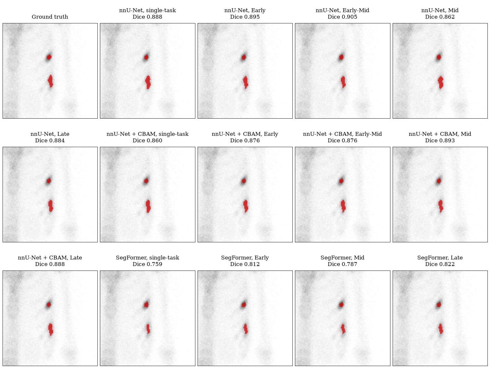
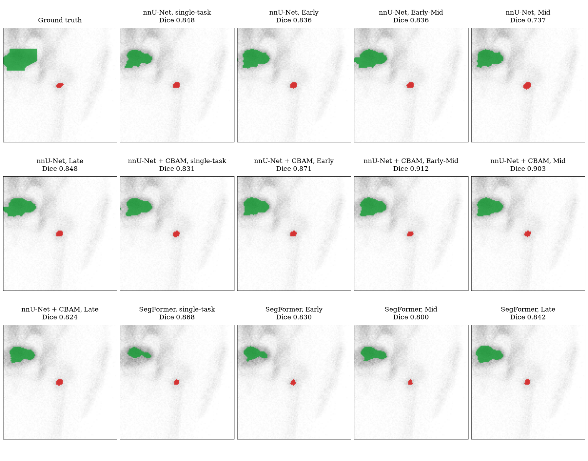
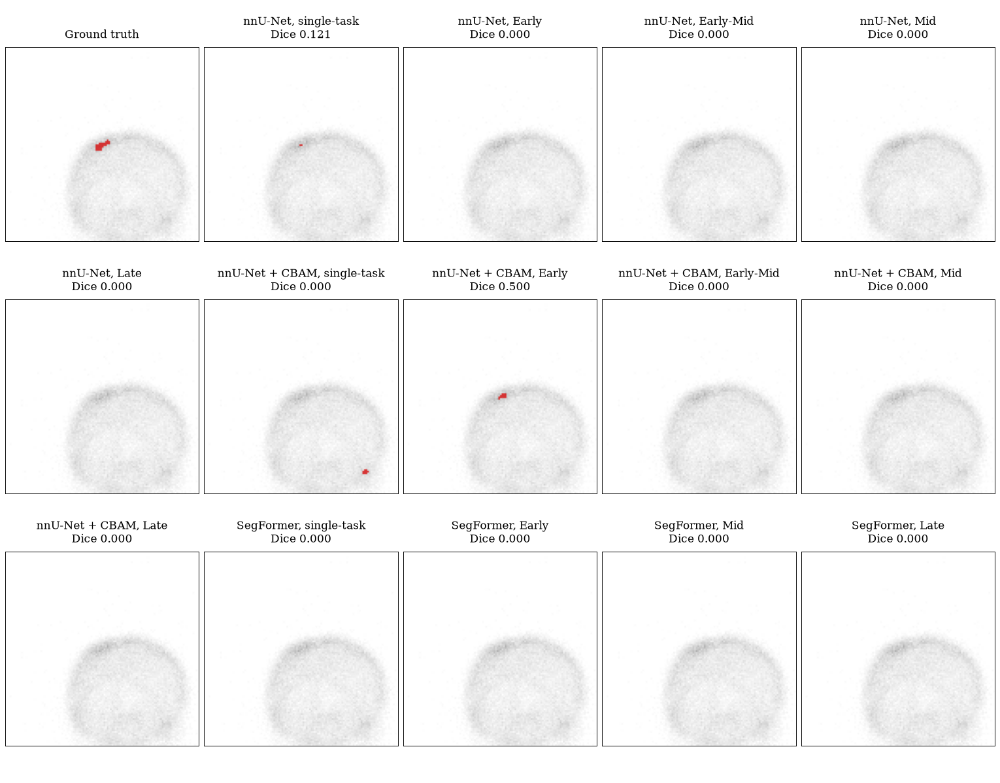
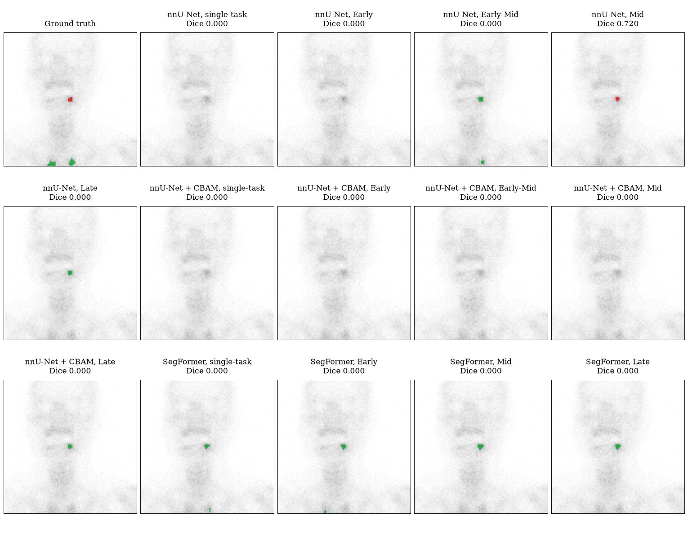
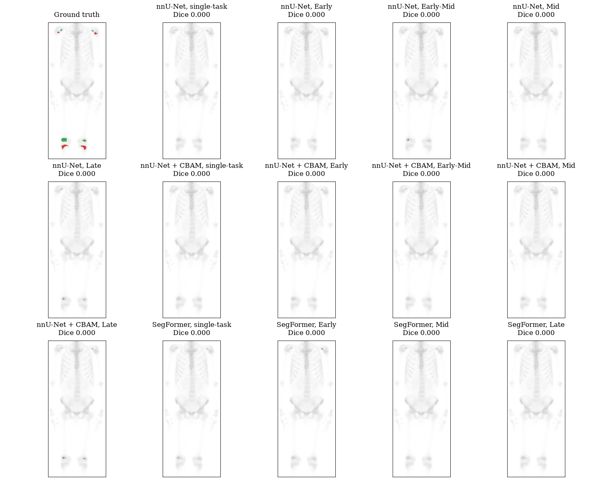
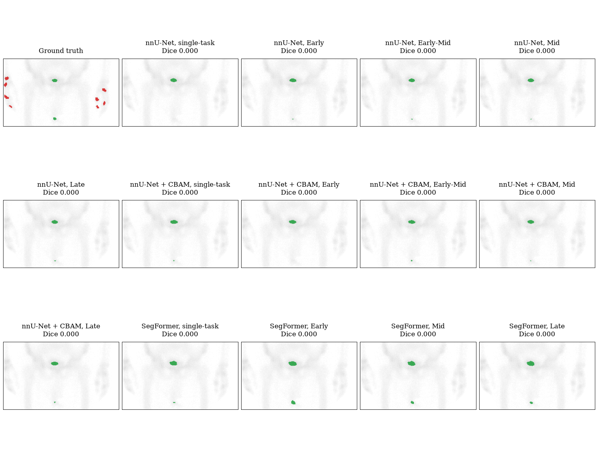
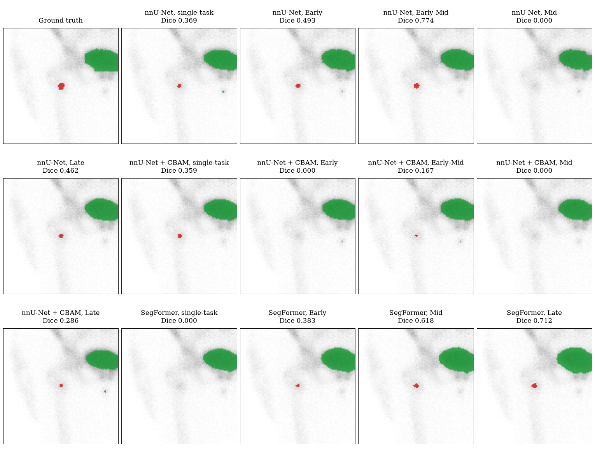
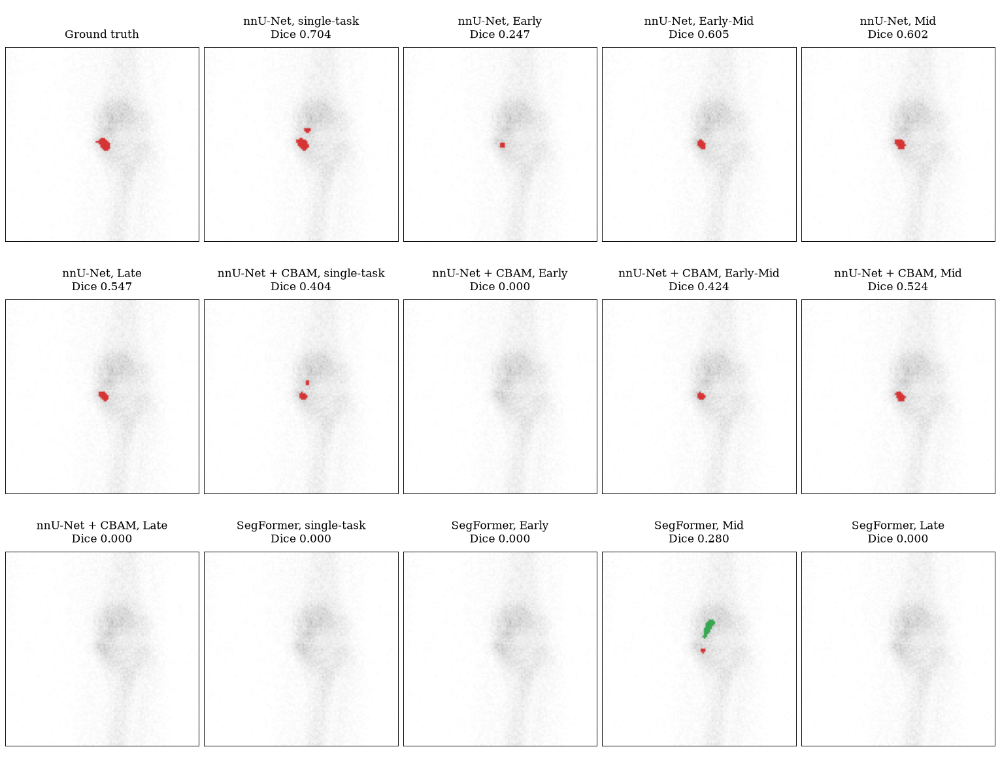

# S7. Comparison examples of all fourteen checkpoints

Each figure shows one test image next to the predictions of the fourteen checkpoints, cropped around the ground-truth malignant hotspot. Green is benign and red is malignant. The title of each panel gives the checkpoint and the malignant Dice of that image.

The masks come from the standard prediction pipeline for the nnU-Net-based checkpoints, not from the UQ run, so they differ slightly from the masks of Figure 5 and of the section on uncertainty examples. For the SegFormer checkpoints the two runs are identical. The malignant Dice of an image is computed on these masks, the mean over the 203 images with a malignant hotspot equals the standard-pipeline value of each checkpoint in `tables/dice_by_model.csv`.

Of the 203 test images with a malignant hotspot, 23 are missed by all fourteen checkpoints and 45 by the proposed checkpoint.

## Selection rules

| Category | Rule |
|:---|:---|
| Easy | The two images with the highest mean Dice over the fourteen checkpoints. |
| Hard | Among the images where at least one checkpoint reaches a Dice of 0.5, the two with the lowest mean Dice over the fourteen checkpoints. |
| Failure | Among the images where all fourteen checkpoints have a Dice of 0, the two with the largest malignant hotspot area. |
| Missed | Among the images where the proposed checkpoint (`nnunetcbam_multidecoder`) has a Dice of 0 and at least seven checkpoints reach a Dice of 0.3, the two where the most checkpoints do. |

Ties are broken by the case number. The malignant Dice of every checkpoint on every one of the images is in `tables/malignant_dice_by_image.csv`, and the selected images are in `tables/comparison_examples.csv`.

## Easy

### Case `bs80k_2319`, anterior view

Ground-truth malignant area 94 pixels. Mean Dice over the checkpoints 0.8577, best 0.9050, checkpoints with a Dice of at least 0.3: 14.

### Case `bs80k_2917`, posterior view

Ground-truth malignant area 29 pixels. Mean Dice over the checkpoints 0.8419, best 0.9123, checkpoints with a Dice of at least 0.3: 14.

## Hard

### Case `bs80k_3114`, posterior view

Ground-truth malignant area 31 pixels. Mean Dice over the checkpoints 0.0444, best 0.5000, checkpoints with a Dice of at least 0.3: 1.

### Case `bs80k_0053`, anterior view

Ground-truth malignant area 14 pixels. Mean Dice over the checkpoints 0.0514, best 0.7200, checkpoints with a Dice of at least 0.3: 1.

## Failure

### Case `bs80k_2626`, anterior view

Ground-truth malignant area 556 pixels. Mean Dice over the checkpoints 0.0000, best 0.0000, checkpoints with a Dice of at least 0.3: 0.

### Case `bs80k_3011`, anterior view

Ground-truth malignant area 330 pixels. Mean Dice over the checkpoints 0.0000, best 0.0000, checkpoints with a Dice of at least 0.3: 0.

## Missed

### Case `bs80k_2917`, anterior view

Ground-truth malignant area 38 pixels. Mean Dice over the checkpoints 0.3301, best 0.7742, checkpoints with a Dice of at least 0.3: 8.

### Case `bs80k_2866`, anterior view

Ground-truth malignant area 43 pixels. Mean Dice over the checkpoints 0.3098, best 0.7037, checkpoints with a Dice of at least 0.3: 7.
