# S9. Training details

One training run per configuration. The case split and the labels are described in S11 and S12.

## Software and hardware

| Item | Version | Recorded in |
|:---|:---|:---|
| PyTorch | 2.11.0+cu128 | debug.json of the nnU-Net runs |
| PyTorch (SegFormer environment) | 2.11.0+cu128 | uv.lock of segformer_multitask |
| Transformers | 5.16.1 | uv.lock of segformer_multitask |
| nnU-Net (multi-task fork) | 2.8.0 | pyproject.toml of nnunetv2_multitask |
| GPU of the nnU-Net runs | NVIDIA GeForce RTX 5070 Ti | debug.json of the nnU-Net runs |

The nnU-Net run files do not record a training seed. The SegFormer runs use seed 42, the same seed as the case split. The GPU is not recorded in the SegFormer run files.

## nnU-Net and nnU-Net with CBAM, settings shared by the ten checkpoints

| Setting | Value |
|:---|:---|
| Input | two channels, the anterior and the posterior view, patch size 896x256 pixels |
| Batch size | 4 |
| Network | 8 stages, features per stage 32-64-128-256-512-512-512-512 |
| Optimizer | SGD with Nesterov momentum 0.99, weight decay 3e-05 |
| Learning rate | 0.01, polynomial decay |
| Epochs | 100 |
| Foreground oversampling | 0.33 |
| Loss | Dice and cross-entropy per task with deep supervision, tasks summed with the weights below |
| Fold | 0 (one run, the case split of S12) |

## nnU-Net and nnU-Net with CBAM, settings that differ

| Checkpoint | Backbone and fission | Trainer | Plans | Network class | CBAM | Initialization | Task weights, hotspot / skeleton | Training log date |
|:---|:---|:---|:---|:---|:---|:---|:---|:---|
| `nnunet_single` | nnU-Net, single-task | `nnUNetTrainerMultiTask_100epochs` | `nnUNetPlansA1Lesion2GB` | MultiTaskDualHeadUNet | no | random | - | 2026-08-29 |
| `nnunetcbam_single` | nnU-Net + CBAM, single-task | `nnUNetTrainerMultiTask_100epochs` | `nnUNetPlansA1ControlledBatch4CBAMPostNorm` | MultiTaskDualHeadUNet | yes | random | - | 2026-09-02 |
| `nnunet_early` | nnU-Net, Early | `nnUNetTrainerMultiTask_100epochs` | `nnUNetPlansA3ControlledBatch4` | MultiTaskDualDecoderUNet | no | random | 0.8/0.2 | 2026-08-29 |
| `nnunet_earlymid` | nnU-Net, Early-Mid | `nnUNetTrainerMultiTask_100epochs` | `nnUNetPlansMultiTaskEarlyMid` | MultiTaskEarlyMidUNet | no | random | 0.8/0.2 | 2026-09-01 |
| `nnunet_mid` | nnU-Net, Mid | `nnUNetTrainerMultiTask_100epochs` | `nnUNetPlansMultiTaskMid` | MultiTaskMidUNet | no | random | 0.8/0.2 | 2026-09-01 |
| `nnunet_late` | nnU-Net, Late | `nnUNetTrainerMultiTask_100epochs` | `nnUNetPlansMultiTask2GB` | MultiTaskDualHeadUNet | no | random | 0.8/0.2 | 2026-08-29 |
| `nnunetcbam_multidecoder` | nnU-Net + CBAM, Early | `nnUNetTrainerMultiTaskDualDecoderCBAMWarmStart_100epochs` | `nnUNetPlansMultiTaskDualDecoderCBAMPostNorm` | MultiTaskDualDecoderUNet | yes | single-task CBAM weights | 0.8/0.2 | 2026-09-05 |
| `nnunetcbam_earlymid` | nnU-Net + CBAM, Early-Mid | `nnUNetTrainerMultiTaskEarlyMidCBAMWarmStart_100epochs` | `nnUNetPlansMultiTaskEarlyMidCBAMPostNorm` | MultiTaskEarlyMidUNet | yes | single-task CBAM weights | 0.8/0.2 | 2026-09-10 |
| `nnunetcbam_mid` | nnU-Net + CBAM, Mid | `nnUNetTrainerMultiTaskMidCBAMWarmStart_100epochs` | `nnUNetPlansMultiTaskMidCBAMPostNorm` | MultiTaskMidUNet | yes | single-task CBAM weights | 0.8/0.2 | 2026-09-10 |
| `nnunetcbam_multihead` | nnU-Net + CBAM, Late | `nnUNetTrainerMultiTaskCBAMWarmStart_100epochs` | `nnUNetPlansMultiTaskCBAMPostNorm` | MultiTaskDualHeadUNet | yes | single-task CBAM weights | 0.8/0.2 | 2026-09-04 |

The single-task checkpoints are one-task instances of the same network class. Source: `tables/training_nnunet.csv`.

## SegFormer

| Setting | Value |
|:---|:---|
| Backbone | mit_b2, initialized from `nvidia/mit-b2`, MLP decoder dimension 256 |
| Input | 1024x512 pixels, the two views side by side, batch size 4 |
| Optimizer | adamw, learning rate 1e-05 for the backbone and 0.0001 for the head, weight decay 0.01 |
| Schedule | poly decay with 1500 warm-up iterations |
| Loss | Dice and cross-entropy, weights 1.0 and 1.0, tasks summed with the weights in the table below |
| Epochs | 100 |
| Precision | bf16 mixed precision |
| Seed | 42 |

| Checkpoint | Backbone and fission | Run folder | Task mode | Initialization | Task weights, hotspot / skeleton | Checkpoint metric |
|:---|:---|:---|:---|:---|:---|:---|
| `segformer_single` | SegFormer, single-task | single_task | single_task | nvidia/mit-b2 | - | foreground_mean_dice |
| `segformer_early` | SegFormer, Early | dual_decoder | dual_decoder | nvidia/mit-b2 | 0.8/0.2 | task_a_foreground_mean_dice |
| `segformer_mid` | SegFormer, Mid | dual_fuse | dual_fuse | nvidia/mit-b2 | 0.8/0.2 | task_a_foreground_mean_dice |
| `segformer_late` | SegFormer, Late | dual_head | dual_head | nvidia/mit-b2 | 0.8/0.2 | task_a_foreground_mean_dice |

Source: `tables/training_segformer.csv`.

## Warm start of the multi-task CBAM checkpoints

The four multi-task nnU-Net with CBAM checkpoints (Early, Early-Mid, Mid, and Late) are not trained from random weights. Each starts from the weights of the single-task nnU-Net with CBAM checkpoint. The shared encoder, the shared decoder stages, the decoder stages of the lesion task, and the lesion output head take the single-task values, and the decoder stages of the skeleton task and the skeleton output head keep their random initialization.

The weights are matched by name and shape. For the Early fission checkpoint, the single-task decoder has the same shape as the lesion decoder of the two-decoder network, so the names differ only by the prefix `decoder.` against `decoders.lesion.`. The trainers check at run time that every key left out belongs to the skeleton branch and stop the run if any other key is missing or has another shape, so a partial transfer cannot pass unnoticed. The nnU-Net option `-pretrained_weights` is not used because it requires every key of the target network in the source checkpoint, which the skeleton branch cannot satisfy.

The plain nnU-Net multi-task checkpoints and the single-task checkpoints are trained from random weights.

## First training of the Early fission CBAM model

The first multi-task CBAM run with the Early fission network, trained from random weights, collapsed. It predicted almost no malignant regions, and every number computed from its predictions was degenerate. That checkpoint is not the checkpoint of the paper.

The cause was examined on the Late fission network with three instrumented 5-epoch runs. The collapse is a smooth and fast slide of the lesion output into predicting background everywhere, complete within about 140 training steps, inside the first epoch. The gradient of the lesion head does not vanish. It shrinks as the prediction saturates, the usual behavior of softmax gradients near an extreme. The pressure comes from the class imbalance between lesion and background pixels, so another random initialization is pushed in the same direction. The single-task CBAM network, trained with the same normalization fix on the same lesion data, left this state by about epoch 89 in two runs.

An earlier retrain of the Early fission run, trained under another plan name, is reported in the notes of the code with an anterior malignant Dice rising from 0.2245 to 0.5990 and the predicted malignant regions from 0 to 355 against 353 in the ground truth. It is not the checkpoint of the paper either.

The checkpoint of the paper (`nnunetcbam_multidecoder`) was trained with the warm start from the single-task CBAM weights, trainer `nnUNetTrainerMultiTaskDualDecoderCBAMWarmStart_100epochs`, on 2026-09-05. The Early-Mid, Mid, and Late multi-task CBAM checkpoints use the same fix.

## Training curves

### SegFormer

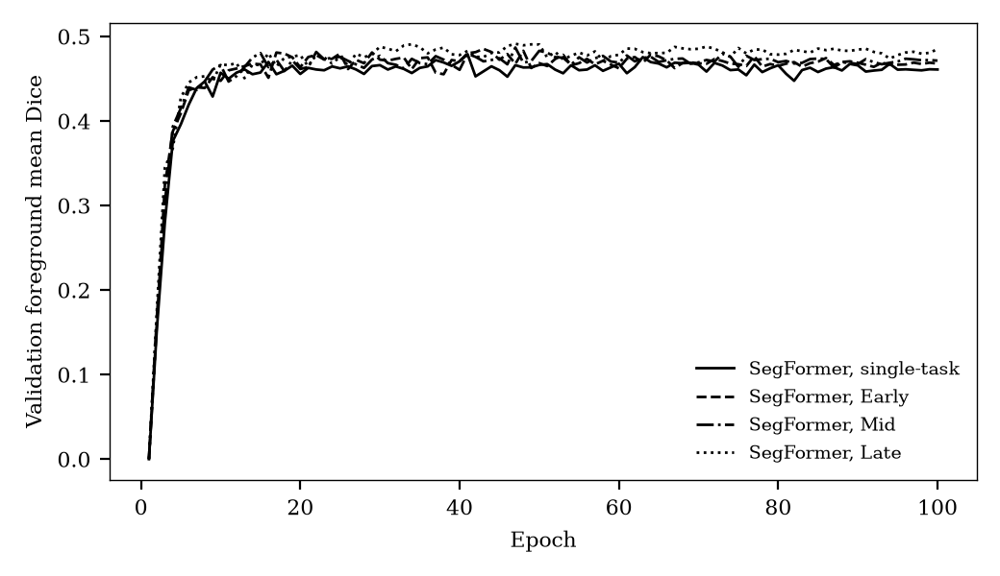

Validation foreground mean Dice per epoch. For the multi-task checkpoints it is the Dice of the lesion task. Source: `tables/curve_segformer_*.csv`.

### nnU-Net and nnU-Net with CBAM

#### nnU-Net, single-task (`nnunet_single`)

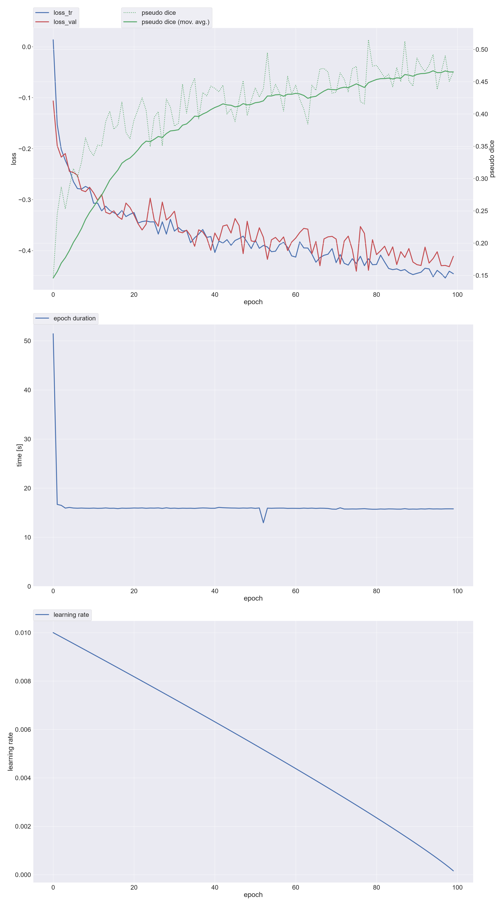

#### nnU-Net + CBAM, single-task (`nnunetcbam_single`)

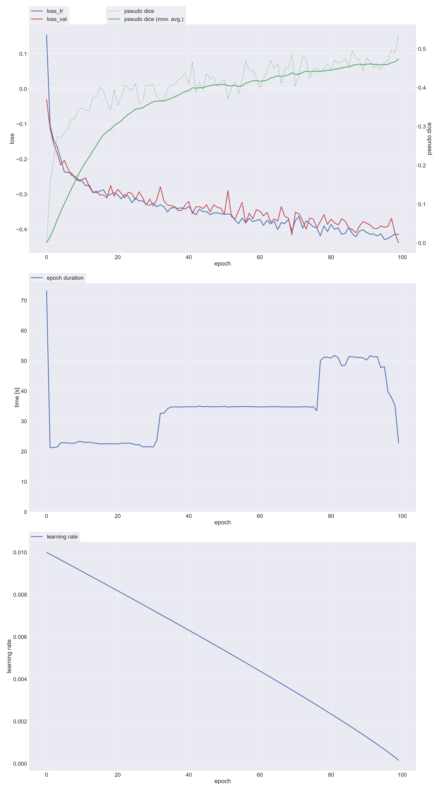

#### nnU-Net, Early (`nnunet_early`)

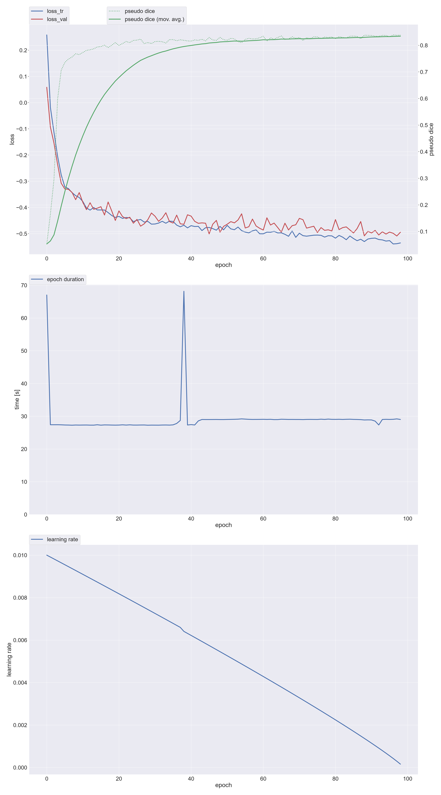

#### nnU-Net, Early-Mid (`nnunet_earlymid`)

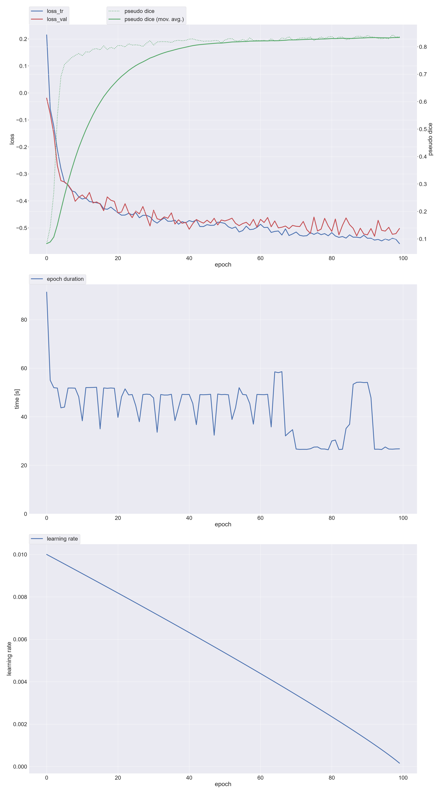

#### nnU-Net, Mid (`nnunet_mid`)

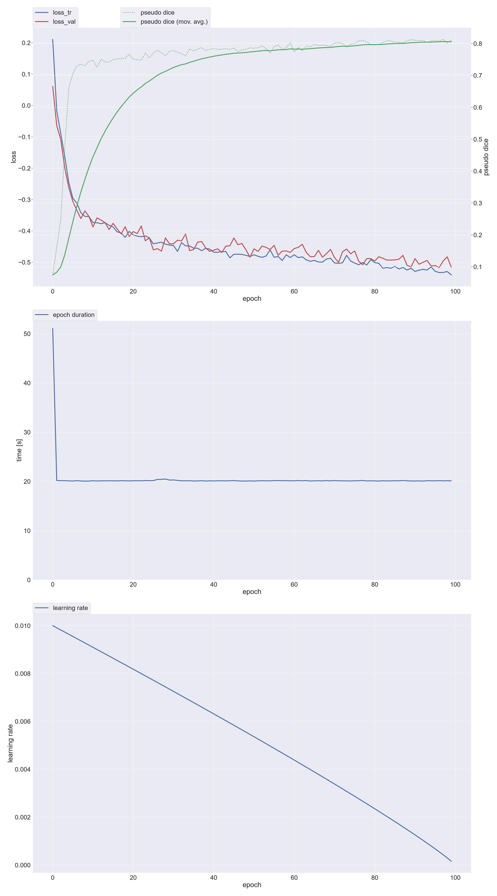

#### nnU-Net, Late (`nnunet_late`)

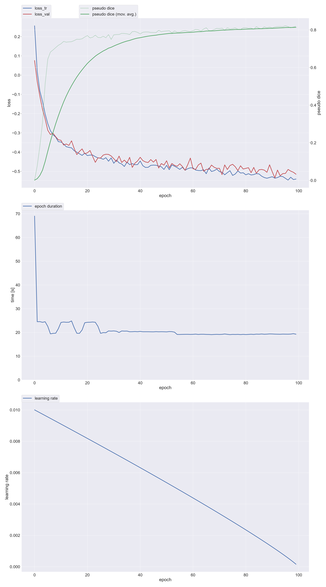

#### nnU-Net + CBAM, Early (`nnunetcbam_multidecoder`)

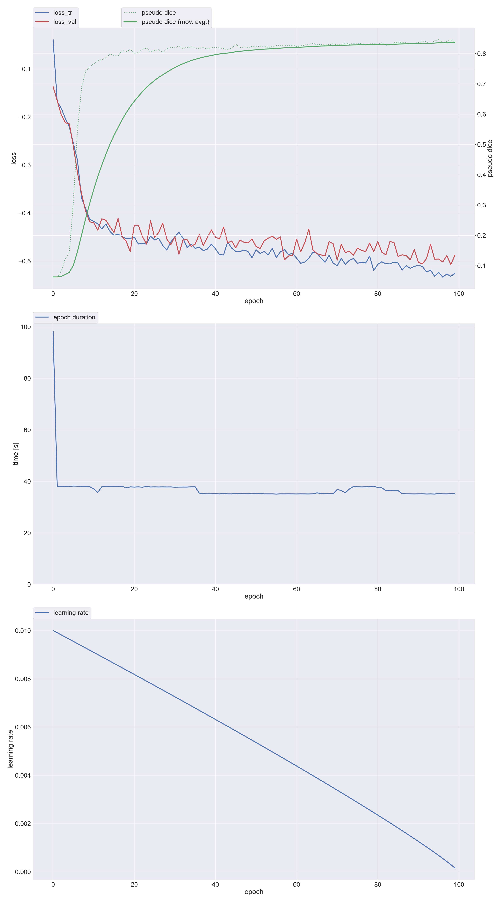

#### nnU-Net + CBAM, Early-Mid (`nnunetcbam_earlymid`)

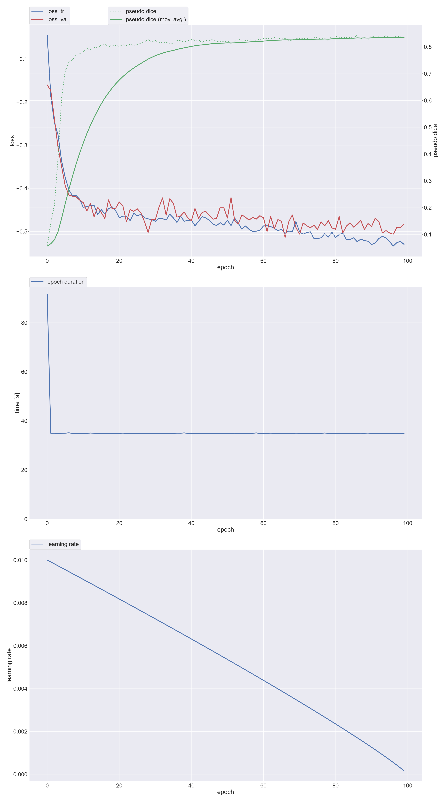

#### nnU-Net + CBAM, Mid (`nnunetcbam_mid`)

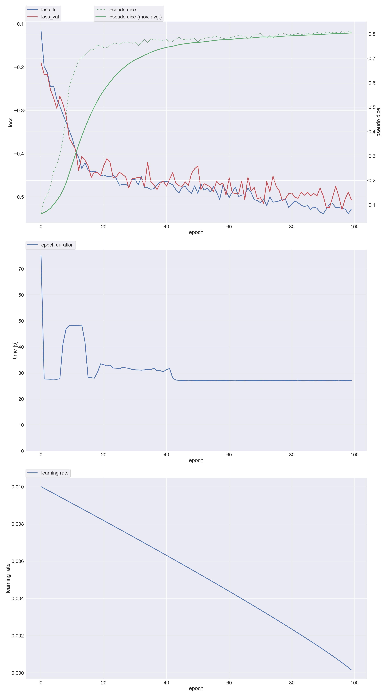

#### nnU-Net + CBAM, Late (`nnunetcbam_multihead`)

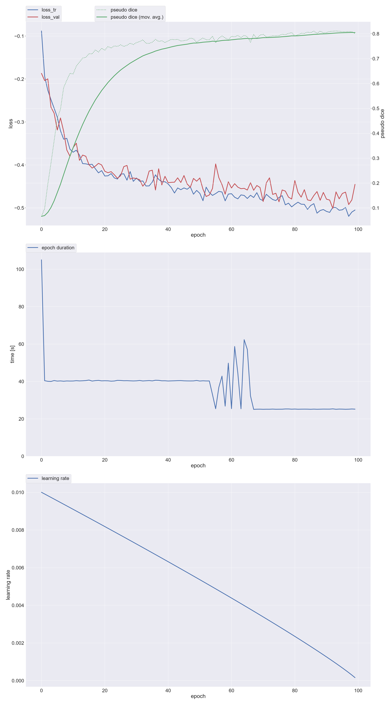

The plots are written by nnU-Net during training: losses, the pseudo Dice on the validation cases, the epoch time, and the learning rate.
