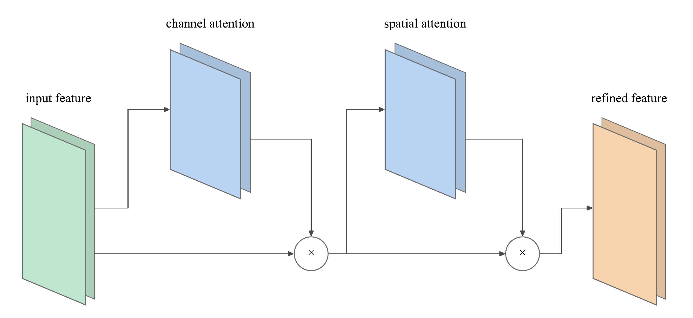
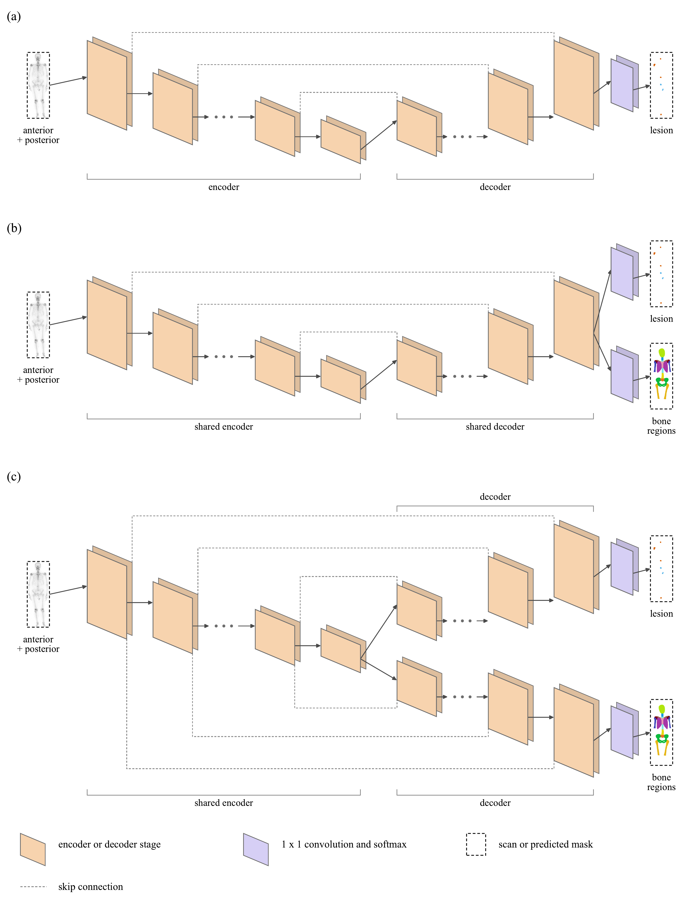
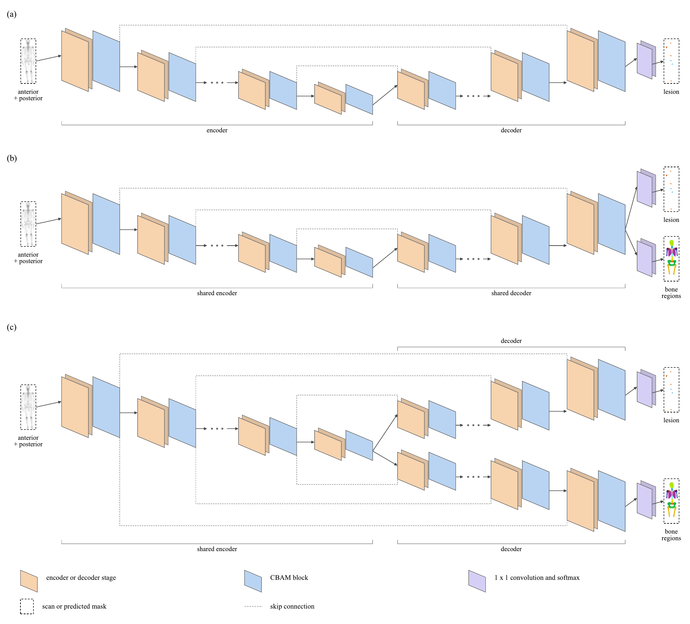
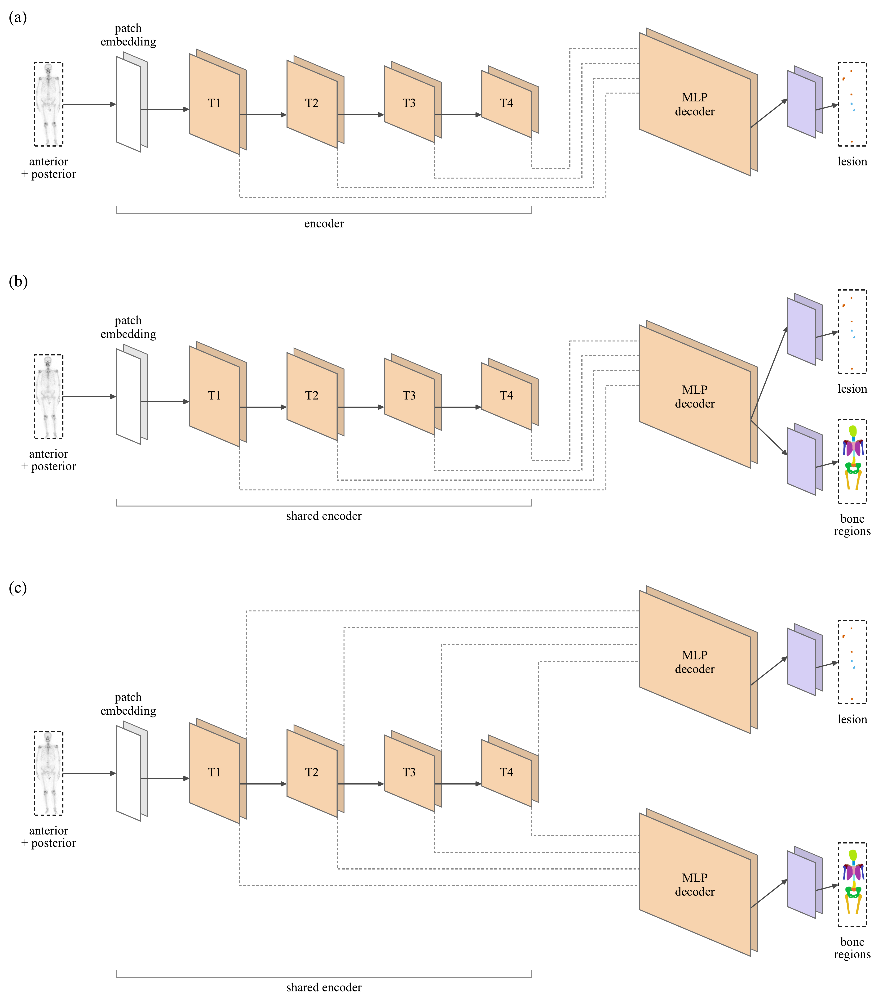

# S10. Architecture diagrams

## CBAM block

The input feature map passes through channel attention, is multiplied by the channel attention weights, passes through spatial attention, and is multiplied by the spatial attention weights. The result is the refined feature map. The block is used after every encoder stage, every decoder stage, and the bottleneck of the nnU-Net with CBAM checkpoints, with a reduction of 16 and a spatial kernel of 7.

## nnU-Net

(a) The single-task network with one decoder. (b) The multi-task network with a shared encoder and a shared decoder that splits into a lesion head and a skeleton head, Late fission. (c) The multi-task network with a shared encoder and one decoder for each task, Early fission. The Early-Mid and Mid networks are drawn in Figure 4 of the paper (`figures/decoder_fission_points.png`).

## nnU-Net with CBAM

The same three networks with a CBAM block after every encoder and decoder stage.

## SegFormer

(a) The single-task network: a patch embedding, four transformer stages T1 to T4 as the encoder, and an MLP decoder that takes the outputs of the four stages. (b) The multi-task network with a shared MLP decoder and two output heads, Late fission. (c) The multi-task network with one MLP decoder for each task, Early fission. The Mid network, in which the two tasks share only the projection stage of the decoder, is not drawn.
