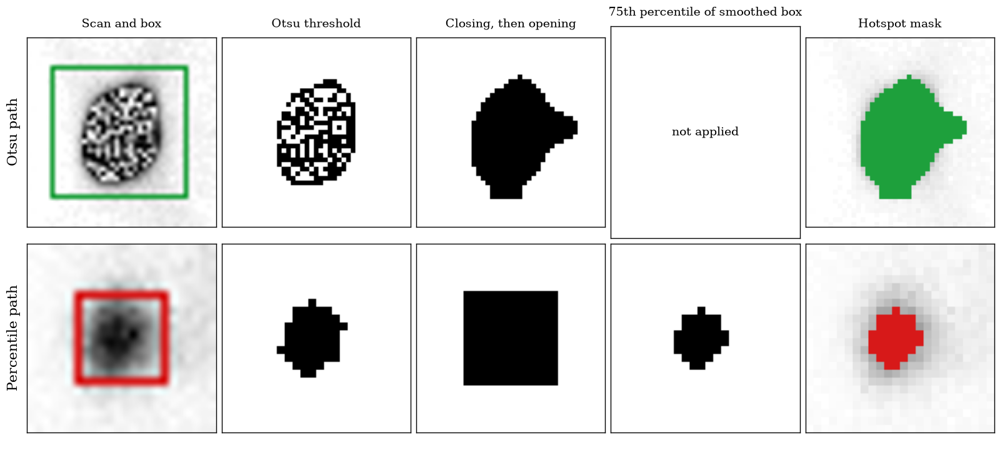

# S11. Label generation in detail

## Hotspot masks

BS-80K provides one bounding box for each hotspot, marked normal or abnormal. The two classes are the benign class (normal) and the malignant class (abnormal). Inside each box the mask is made in the six steps below, with the settings of the table.

1. Crop the box from the scan.

2. Threshold the box with Otsu's method.

3. Close the mask with an elliptical kernel, then open it.

4. Check the mask. It fails the check when it is empty, covers more than 85% of the box, or when more than 65% of the pixels on the border of the box are in the mask.

5. For a mask that fails, replace it with the percentile mask: smooth the box with a Gaussian filter, keep the pixels at or above the 75th percentile, keep the largest connected region, fill its holes, and close it with a 3 x 3 kernel.

6. If the mask is still empty, draw an ellipse at the brightest pixel of the box.

| Setting | Value |
|:---|:---|
| Kernel | elliptical, 7 x 7 pixels |
| Closing | 2 iterations |
| Opening | 1 iteration |
| Maximum coverage of the box | 0.85 |
| Maximum border contact | 0.65 |
| Percentile of the smoothed box | 75 |
| Gaussian smoothing sigma | 1.5 pixels |

## Share of boxes on each path

| Path | Boxes | Share of the boxes | Median box area in pixels |
|:---|---:|---:|---:|
| Otsu path, mask passes the check (steps 1 to 4) | 1,207 | 5.2% | 576 |
| Percentile path, mask replaced (step 5) | 21,873 | 94.8% | 90 |

All 23,080 boxes end on one of the two paths, so step 6 is not reached. The Otsu path covers the larger boxes. Source: `tables/hotspot_mask_paths.csv`.

## Example of each path

Otsu path: case `bs80k_1538`, anterior view. Percentile path: case `bs80k_1420`, anterior view. Each column is the image after the step named above it. The Otsu path does not use the percentile step. Source: `tables/hotspot_mask_examples.csv`.

## The other algorithms tried

| Algorithm | Can leave the box | Boxes checked | Segments per box, mean | Segments per box, maximum |
|:---|---:|---:|---:|---:|
| GrabCut with seeds and context | yes | 23,080 | 1.0011 | 3 |
| Otsu with morphology and guarded smooth fallback (used) | no | 23,080 | 1.0000 | 1 |
| Random walker with seeds | no | 23,080 | 1.0000 | 1 |
| Full box | no | - | - | - |

Each algorithm turns a bounding box into a mask. GrabCut is the only one that can place pixels outside the box, and in some boxes it returns up to three segments. The full box uses the whole box as the mask. Source: `tables/hotspot_algorithms.csv`.

## Skeleton labels

The skeleton mask has twelve regions and background: skull, cervical vertebrae, thoracic vertebrae, ribs, sternum, clavicle, scapula, humerus, lumbar vertebrae, sacrum, pelvis, femur. Part of the views were annotated manually. For the other views the mask is the prediction of an nnU-Net trained on the manual masks.

| Set | Manual | Predicted | Manual share |
|:---|---:|---:|---:|
| All of BS-80K, views | 3,593 | 2,901 | 55.3% |
| The 2,925 cases used, views | 3,414 | 2,436 | 58.4% |

The counts of the cases used are the sum over the three splits in `tables/split_counts.csv`, the counts of BS-80K are from the label list of the merged skeleton masks (`tables/skeleton_label_sources_bs80k.csv`).

| Setting of the predicting nnU-Net | Value |
|:---|:---|
| Configuration | 2d |
| Classes | 13 (background and twelve regions) |
| Views used for training | 3,239 |
| Patch size | 1024x256 |
| Batch size | 12 |
| Normalization | ZScoreNormalization |
| Views predicted | 2,901 |

The settings are read from the plans saved with the predictions. Source: `tables/skeleton_pseudo_label_model.csv`.

## Cross-check of the skeleton masks against the bone boxes

The bone-region boxes of BS-80K (template-matched crops) are compared with boxes built from the skeleton masks: for each crop region the boxes of the bone regions inside it are united, and the agreement is scored with the intersection over union and two directional containment ratios. Regions marked no for full containment are crops that frame only part of the bone, such as the elbow and knee crops for the humerus and femur masks.

| Crop region | Views | Mean IoU | Median IoU | Mean containment in template | Mean containment in segmentation | Full containment expected |
|:---|---:|---:|---:|---:|---:|:---|
| chestL | 5850 | 0.5924 | 0.5867 | 0.6670 | 0.8527 | yes |
| chestR | 5850 | 0.6063 | 0.6042 | 0.6766 | 0.8667 | yes |
| elbowL | 5850 | 0.0654 | 0.0664 | 0.2064 | 0.0872 | no |
| elbowR | 5850 | 0.0416 | 0.0000 | 0.1361 | 0.0535 | no |
| head | 5850 | 0.7616 | 0.7626 | 0.8202 | 0.9250 | yes |
| kneeL | 5850 | 0.0376 | 0.0389 | 0.1033 | 0.0555 | no |
| kneeR | 5850 | 0.0343 | 0.0353 | 0.0941 | 0.0509 | no |
| pelvis | 5850 | 0.8286 | 0.8309 | 0.8622 | 0.9545 | yes |
| shoL | 5850 | 0.3628 | 0.3864 | 0.4914 | 0.5270 | yes |
| shoR | 5850 | 0.3650 | 0.3902 | 0.4871 | 0.5346 | yes |
| vertbra | 5850 | 0.4922 | 0.4901 | 0.9797 | 0.4996 | yes |

Source: `tables/skeleton_box_crosscheck.csv`.
